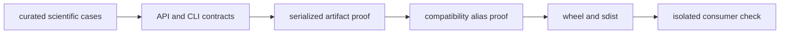

# Release and versioning

Core versions are resolved from repository Git tags through `hatch-vcs`. A Core
release is trustworthy only when its scientific meaning, executable interfaces,
and published artifacts agree at that version.

## Release classification

Classify changes by their consumer consequence:

| Class | Examples | Evidence |
| --- | --- | --- |
| implementation | faster indexing with identical results | reference-result and performance comparison |
| additive | new command or optional result field | API/CLI snapshots and old-consumer proof |
| narrowing | stricter validation or reduced accepted notation | rejected-case inventory and migration guidance |
| scientific | changed algorithm, threshold, normalization, or uncertainty | benchmark and interpretation dossier |
| breaking | removed symbol, renamed column, changed persisted meaning | compatibility route and explicit release notice |

Scientific notes identify whether an effect concerns accuracy, robustness,
interpretability, or implementation only. Performance claims include the data
shape and measurement conditions; they are not inferred from code structure.

## Build the evidence chain



Run the package release gates from the repository root:

```bash
make test PACKAGE=bijux-proteomics-core
make quality PACKAGE=bijux-proteomics-core
make api PACKAGE=bijux-proteomics-core
make build PACKAGE=bijux-proteomics-core
make test PACKAGE=proteomics-core
```

Select additional benchmark or regression routes for the scientific domains
that changed. The general package suite establishes breadth; it does not replace
domain evidence for a new calculation or decision threshold.

## Changelog and downstream impact

Update `packages/bijux-proteomics-core/CHANGELOG.md` with the owning domain,
affected inputs and outputs, scientific interpretation, compatibility class,
and required action. Name downstream impact on Runtime, Intelligence,
Knowledge, or Lab when their artifacts or decisions consume the changed Core
contract.

Keep release wording aligned with the repository's
[current capability limits](../../01-bijux-proteomics/foundation/current-capability-limits.md).
A new parser or report does not establish end-to-end biological validity, and a
passing benchmark does not establish performance outside its declared regime.

After publication, install the exact wheel in an empty environment, import the
curated root, invoke the CLI for an affected workflow, and compare a
representative result with the release evidence. Verify `proteomics-core`
separately when its forwarded surface changed. These checks prove what a
consumer receives, not only what the source tree contained.
