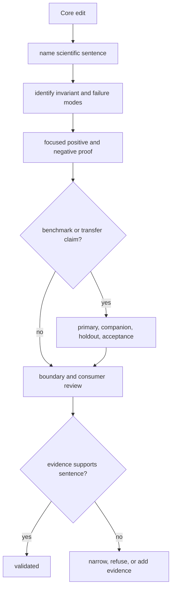

# Change validation

Validate Core changes against the scientific sentence they alter. The proof
must widen when a change moves from implementation detail to public model,
algorithm, artifact, workflow-family behavior, or benchmark posture.

## Change-to-proof map

| Change | Required proof | Claim review |
| --- | --- | --- |
| parser or adapter | accepted and rejected fixtures, mutation cases, producer/version provenance, stable export | native versus imported language |
| domain model or lifecycle | invariants, forbidden combinations and transitions, schema and consumer compatibility | public contract meaning |
| score, FDR, threshold, or inference | reference values, orientation, boundaries, ties, missingness, decoys, sensitivity | acceptance and confidence language |
| quantification or normalization | design, scale, zero/missing distinctions, batch, ordering, reproducibility | transfer and quantitative truth |
| PTM, DIA, or targeted rule | ambiguity, library or panel context, calibration, interference, acceptance | family-specific ceiling |
| benchmark asset or acceptance bar | license, lineage, freshness, holdout role, expected failure, generated artifacts | release-readiness matrix |
| performance implementation | serial equivalence, determinism, exhaustion, cancellation, partial output | no scientific claim widens from speed alone |
| public CLI, API, or artifact | parity, schema, round trip, errors, lineage, downstream reader | public examples and compatibility |

## Validation route

Inspect accepted, rejected, failed, and missing counts—not only the headline
result. Compare policies and provenance as well as numeric output. Run affected
Runtime, Knowledge, Intelligence, or Lab boundary tests when the artifact
crosses package ownership.

## Validation record

State input level and provenance, scientific policy, expected result and
negative disposition, reference or benchmark independence, tolerances,
workflow family, transfer envelope, exact checks, and resulting public claim.
If a relevant corpus or consumer was not run, preserve that gap explicitly.
