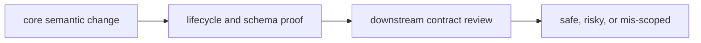

# Change Validation

Change validation should make it obvious whether a package edit is safe, risky, or mis-scoped.

## Validation Model

This page should make core validation feel like contract defense. The package
is safe to change only when a reviewer can tell whether durable meaning moved
and whether proof widened far enough to match that movement.

## Review Rules

- check whether a change alters core meaning or only implementation detail
- run lifecycle and schema proof whenever contract surfaces move
- require downstream review when public core semantics change

## First Proof Check

- `packages/bijux-proteomics-core/tests`
- `src/bijux_proteomics/domain/program_spec.py` and `domain/targets.py`
- `src/bijux_proteomics/domain/lifecycle.py` and `domain/validation.py`

## Design Pressure

Core validation weakens when implementation convenience outruns semantic proof.
If lifecycle and downstream contract checks do not widen when meaning moves,
the review is already underspecified.
