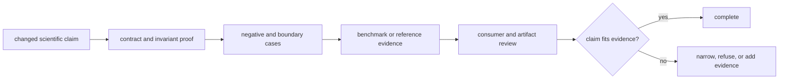

# Definition of done

A Core change is complete when its scientific contract, negative behavior,
artifact meaning, and claim ceiling agree. Compilation, coverage, or one
successful dataset cannot close a change whose public meaning reaches beyond
that evidence.

## Completion by scientific surface

| Changed surface | Required positive evidence | Required challenge evidence |
| --- | --- | --- |
| parser or external-engine adapter | representative accepted records, source identity, round trip or stable export | malformed, truncated, unsupported, and contradictory records |
| domain model or lifecycle | invariant-preserving construction and declared transitions | invalid combination, forbidden transition, refusal, and failure |
| score, threshold, or FDR rule | reference values, orientation, boundary values, and regression fixtures | ties, empty strata, decoys, contaminants, missing values, and sensitivity |
| quantification or normalization | design-aware expected results and stable ordering | sparsity, batch, scale, missingness, zero, and outlier pressure |
| workflow-family behavior | primary package, companion pressure, acceptance bars, and provenance | transfer case that narrows or refuses the family claim |
| public artifact or schema | round trip, compatibility, lineage, and consumer review | unsupported version, incomplete provenance, and rejected payload |
| performance path | serial equivalence, determinism, resource envelope, and retained output | partial failure, cancellation, exhaustion, and nondeterministic ordering |

## Evidence closure

Use the focused domain suite for the edited rule, the relevant scientific
family suite, and benchmark tests when the claim reaches family posture.
Parser changes require the matching importer mutation and malformed-input
evidence. Public API or CLI changes also require parity and consumer checks.

## Completion record

Record the scientific contract, dataset or fixture provenance, parameter and
policy values, expected failure behavior, exact checks, and the strongest
sentence supported after the change. Separate imported external-engine results
from repository-native computation.

## Not complete

The change remains incomplete when an external file parses but rejected rows
disappear, a threshold moves without sensitivity evidence, a benchmark uses
the same assumptions as the implementation it is meant to challenge, or a
successful Runtime execution is treated as proof of scientific acceptance.
