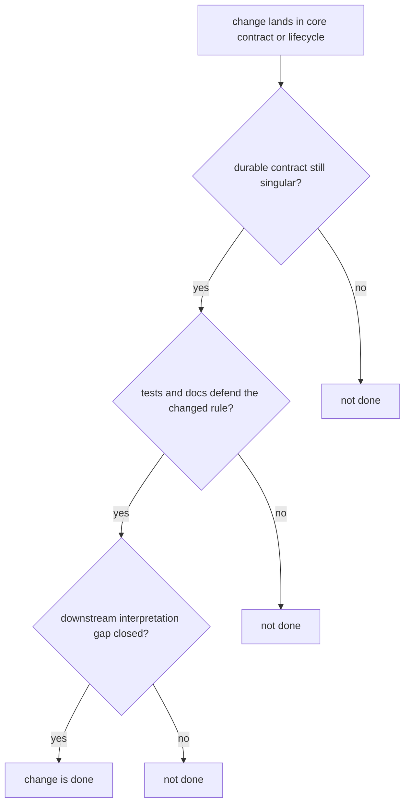

# Definition of Done

Done means the package is easier to trust after the change, not just that the diff merged.

For `bijux-proteomics-core`, done means the durable rule set is clearer after the edit and downstream packages have only one honest interpretation path left.

## Completion Model

This is a contract page, not a merge checklist. The point is to show that lifecycle, schema, and named rules still converge on one durable reading.

## Review Rules

- the contract story is at least as clear as before the edit
- tests and docs defend the changed durable meaning
- downstream consumers have no ambiguous interpretation gap left behind

## First Proof Check

- `packages/bijux-proteomics-core/tests`
- `src/bijux_proteomics/program_spec.py` and `targets.py`
- `src/bijux_proteomics/lifecycle.py` and `validation.py`

## Design Pressure

The common failure is to ship a locally useful behavior change that leaves runtime, intelligence, or operator code guessing what the new core rule really means.
