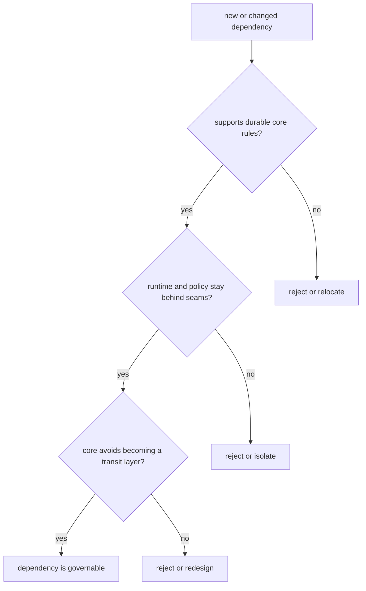

# Dependency Governance

Dependency governance is really boundary governance under another name.

For `bijux-proteomics-core`, dependency review should defend durable rule ownership and keep runtime, policy, or orchestration concerns behind explicit seams.

## Governance Model

The point is not just to minimize dependencies. It is to prevent core from absorbing neighboring responsibilities simply because a library makes that move convenient.

## Review Rules

- guard the boundary between shared foundation dependencies and downstream policy consumers
- keep runtime interaction behind explicit seams
- avoid dependencies that make core a transit point for unrelated concerns

## First Proof Check

- `packages/bijux-proteomics-core/tests`
- `src/bijux_proteomics/domain/program_spec.py` and `domain/targets.py`
- `src/bijux_proteomics/domain/lifecycle.py` and `domain/validation.py`

## Design Pressure

The common drift is to add a dependency that makes core the easiest place to wire something through, even though that turns it into an accidental owner of unrelated concerns.
