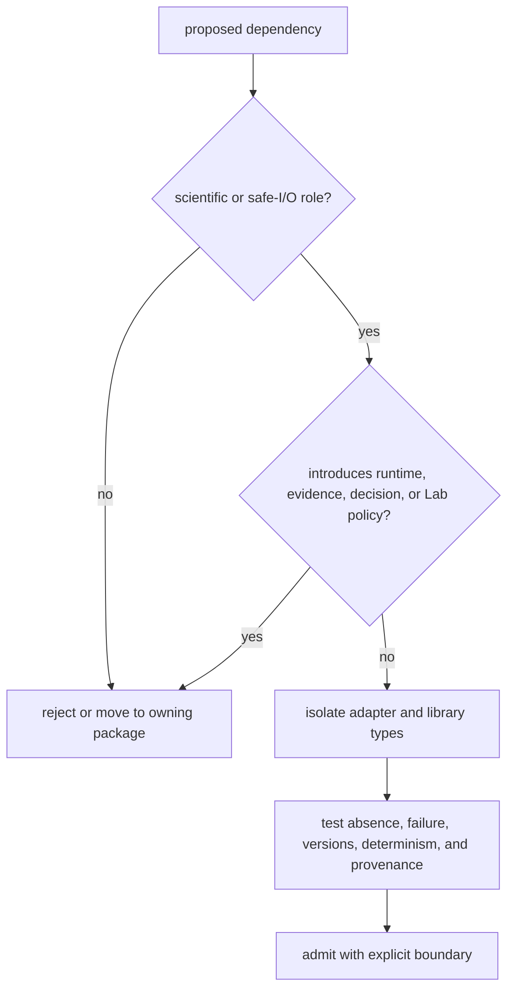

# Dependency governance

Core admits dependencies for scientific contracts, numerical work, safe format
handling, and its public command surface. It must remain usable without
Runtime, Knowledge, Intelligence, Lab, or the historical compatibility package.

## Current dependency roles

| Dependency | Admitted role | Boundary |
| --- | --- | --- |
| Foundation | shared identity, outcomes, provenance, canonical documents | Foundation does not own proteomics policy |
| Pydantic | typed models and validation | dependency behavior affecting schemas or coercion is contract-relevant |
| NumPy | numerical arrays and operations | public results retain explicit units, ordering, and serialization |
| Biopython | sequence and biological format support | Core owns accepted dialect and normalized scientific meaning |
| `defusedxml` | defensive XML ingestion | safe parsing does not imply complete mzML or producer coverage |
| Click | command-line transport | CLI does not become Runtime orchestration authority |
| Loguru | logging | logs are diagnostics, not result or provenance records |
| PyArrow | optional Parquet support | absence fails explicitly and cannot change scientific results silently |

## Admission decision

Review license, support horizon, vulnerability posture, binary footprint,
platform coverage, transitive dependencies, determinism, optionality, and
failure semantics. A convenience library is not justified merely because
several modules could call it.

## Upgrade evidence

Dependency upgrades can change numerical precision, parser acceptance,
sequence interpretation, schema generation, exception classes, ordering,
threading, or output bytes. Run focused reference and malformed-input cases,
serial equivalence, artifacts, public APIs, and workflow benchmarks affected by
the library. Do not approve an upgrade only because imports and unit coverage
remain green.
