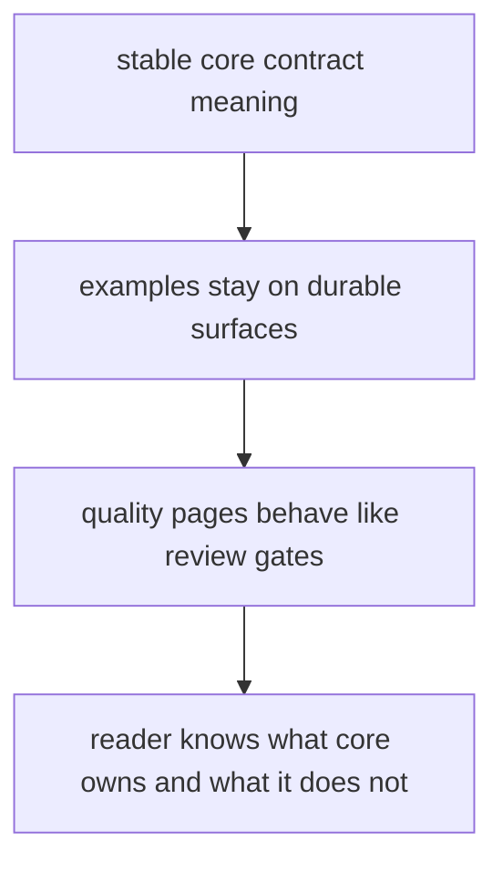

# Documentation Standards

Documentation standards should protect the reader from filler, drift, and false confidence.

For `bijux-proteomics-core`, documentation should keep contract meaning separate from runtime execution and make quality pages read like review gates rather than reassurance.

## Documentation Model

This page should stop core docs from sliding toward nearby convenience paths. Readers should leave with a sharper idea of stable rule ownership, not a blurrier one.

## Review Rules

- docs should help readers distinguish contract meaning from runtime execution
- examples should focus on stable core surfaces, not nearby convenience paths
- quality pages should sound like review gates, not reassurance text

## First Proof Check

- `packages/bijux-proteomics-core/tests`
- `src/bijux_proteomics/program_spec.py` and `targets.py`
- `src/bijux_proteomics/lifecycle.py` and `validation.py`

## Design Pressure

The common drift is to explain runtime-adjacent convenience so heavily that the actual durable contract starts to disappear from view.
