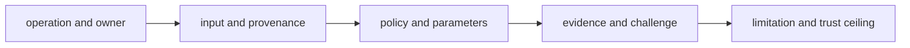

# Documentation standards

Public scientific language must identify what Core computed, what it imported,
which policy shaped the result, which evidence challenged it, and where the
claim stops. Feature breadth is not a substitute for this chain.

## Claim vocabulary

| Term | Required evidence | Does not mean |
| --- | --- | --- |
| **native** | repository-owned transformation from the named input contract | vendor-native raw processing or external-engine parity |
| **imported** | named external producer, version or format, parameters when available, and preserved provenance | independently reproduced computation |
| **validated** | declared invariant and the positive and negative cases that exercise it | universally scientifically correct |
| **benchmark-backed** | identified asset, license, lineage, acceptance bar, and result | broad transfer beyond the benchmark envelope |
| **parity** | named comparator, fields, tolerances, disagreement policy, and versions | interchangeable tools or algorithms |
| **deterministic** | identical supported inputs, configuration, ordering policy, and environment envelope | invariance across arbitrary dependency or hardware changes |
| **supported** | workflow family, run mode, inputs, outputs, and current trust ceiling | every route in the broader proteomics category |

## Claim construction

A useful example ends with a reviewable artifact: accepted and rejected
records, policy, parameters, source identity, warnings, and reason codes. A
numeric output without those fields demonstrates syntax, not scientific trust.

## Comparisons and benchmarks

Name whether a comparator output was imported, replayed, or independently
computed. State exact comparison dimensions and tolerances. Preserve
disagreement instead of averaging it away. Benchmark pages identify asset
custody and licensing, primary versus companion role, holdout status, and the
condition that would narrow the claim.

## Cross-package language

Core owns scientific models and transformations. Runtime owns execution and
retained run state; Knowledge owns evidence and citation custody; Intelligence
owns recommendation policy; Lab owns assay readiness and observed outcomes.
Public prose must not transfer authority merely because Core data appears in a
downstream artifact.

Use [workflow families](../../01-bijux-proteomics/foundation/workflow-families.md)
for current family ceilings and [known limitations](known-limitations.md) for
the limits that apply even when Core checks pass.
