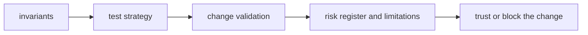

# Quality

`bijux-proteomics-core` quality should tell a reviewer what must remain true, what proof is required, and which risks are serious enough to block a change.

## Trust Model

This page should show core quality as contract defense, not general confidence.
The package stays trustworthy when program, target, and lifecycle meaning
remain explicit enough for downstream packages to build on safely.

## Start With

- open [Invariants](https://bijux.io/bijux-proteomics/04-bijux-proteomics-core/quality/invariants/) before changing package meaning
- open [Change Validation](https://bijux.io/bijux-proteomics/04-bijux-proteomics-core/quality/change-validation/) when you need the minimum proof for a real edit
- open [Risk Register](https://bijux.io/bijux-proteomics/04-bijux-proteomics-core/quality/risk-register/) when the package boundary feels under pressure

## Section Pages

- [Invariants](https://bijux.io/bijux-proteomics/04-bijux-proteomics-core/quality/invariants/)
- [Test Strategy](https://bijux.io/bijux-proteomics/04-bijux-proteomics-core/quality/test-strategy/)
- [Change Validation](https://bijux.io/bijux-proteomics/04-bijux-proteomics-core/quality/change-validation/)
- [Definition of Done](https://bijux.io/bijux-proteomics/04-bijux-proteomics-core/quality/definition-of-done/)
- [Dependency Governance](https://bijux.io/bijux-proteomics/04-bijux-proteomics-core/quality/dependency-governance/)
- [Documentation Standards](https://bijux.io/bijux-proteomics/04-bijux-proteomics-core/quality/documentation-standards/)
- [Known Limitations](https://bijux.io/bijux-proteomics/04-bijux-proteomics-core/quality/known-limitations/)
- [Review Checklist](https://bijux.io/bijux-proteomics/04-bijux-proteomics-core/quality/review-checklist/)
- [Risk Register](https://bijux.io/bijux-proteomics/04-bijux-proteomics-core/quality/risk-register/)

## What Quality Means Here

- proving that durable program and lifecycle contracts stay explicit, stable, and downstream-safe

## First Proof Check

- `packages/bijux-proteomics-core/tests`
- `src/bijux_proteomics/domain/program_spec.py` and `domain/targets.py`
- `src/bijux_proteomics/domain/lifecycle.py` and `domain/validation.py`

## Design Pressure

Core quality weakens when implementation changes are easier to describe than
the contract they move. The section has to keep durable semantics and proof in
the same line of sight.
