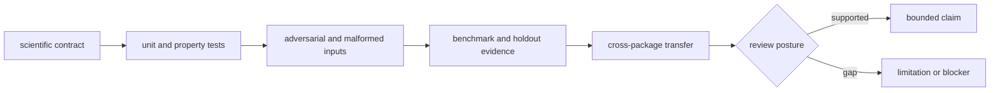
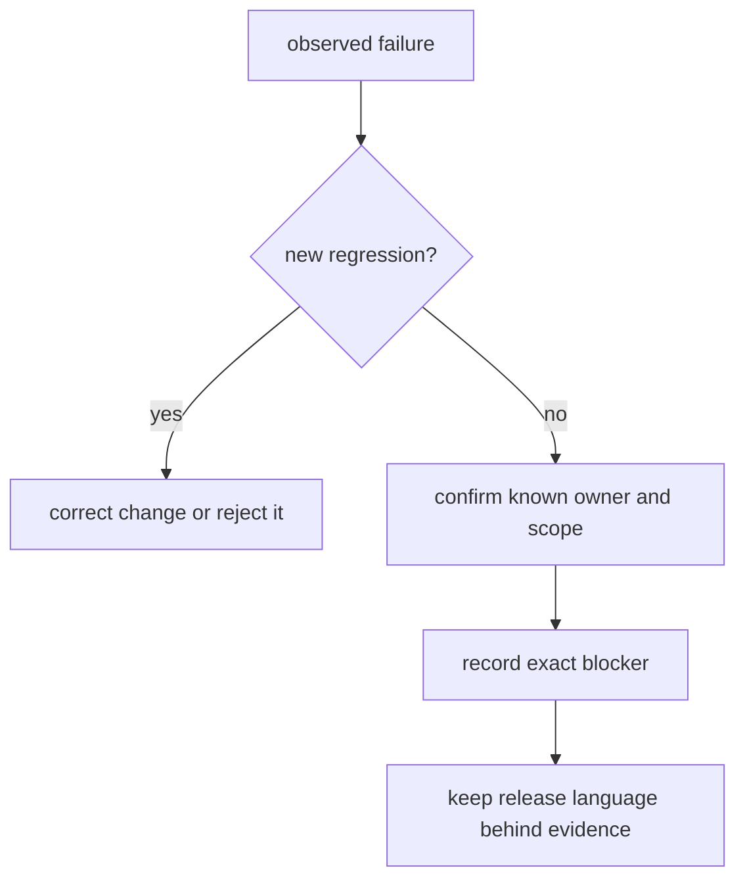

# Scientific quality

Core quality is the ability to detect when an input, algorithm, artifact, or
claim violates its declared scientific contract. It combines software checks
with domain invariants, benchmark challenges, negative paths, provenance, and
explicit limitation records.

## Quality dimensions

| Dimension | Evidence | Blocking example |
| --- | --- | --- |
| contract integrity | typed models, validation, schema and API checks | a field changes meaning without compatibility handling |
| scientific correctness | unit, property, reference, and regression tests | FDR orientation or mass calculation changes unexpectedly |
| input honesty | malformed, ambiguous, contaminant, decoy, and missing-data cases | invalid records are silently accepted or dropped |
| determinism | stable serialization, ordering, hashing, seeded behavior | identical supported inputs produce unexplained artifact drift |
| provenance | source, engine, database, policy, and version records | imported output is presented as native computation |
| benchmark validity | licensed assets, challenge corpus, holdouts, acceptance bars | a public posture survives only on training-like fixtures |
| boundary integrity | dependency, ownership, and public-surface checks | Runtime or recommendation policy is duplicated inside Core |

## Proof by change type

| Change | Minimum scientific proof |
| --- | --- |
| parser or adapter | representative formats, malformed input, rejected records, source identity |
| algorithm or threshold | reference cases, boundary values, regression evidence, sensitivity |
| quantification or normalization | missingness, scale, ordering, batch, and reproducibility cases |
| workflow-family behavior | family corpus, negative cases, acceptance bars, transfer limits |
| public model or artifact | schema compatibility, serialization, round trip, consumer review |
| performance path | serial equivalence, determinism, failure and resource behavior |

[Change validation](change-validation.md) gives the repository commands and
[test strategy](test-strategy.md) maps them to the test layers.

## Invariants

The active invariants include:

- scientific policy is explicit and serialized with the result;
- accepted, rejected, refused, and failed inputs remain distinguishable;
- units, score orientation, thresholds, and missing-value meaning are stable;
- external-engine and reference-data provenance is never inferred from a file
  name alone;
- workflow-family maturity is evaluated independently;
- a completed process is not automatically a scientifically accepted result;
- public facades point to one owner rather than duplicating behavior.

See [invariants](invariants.md) for the detailed contract set.

## Review failure modes

Quality review blocks a change when evidence is absent, stale, circular, or too
narrow for the claim. Passing happy-path tests cannot compensate for missing
negative cases. Documentation cannot strengthen the posture beyond the checked
implementation and artifacts. A known failure stays visible in the
[risk register](risk-register.md) and [known limitations](known-limitations.md)
until its owning evidence closes it.

## Review route

Use [dependency governance](dependency-governance.md) for import and optional
dependency changes, [documentation standards](documentation-standards.md) for
public scientific language, and the [review checklist](review-checklist.md) for
handoff. [Definition of done](definition-of-done.md) requires both successful
evidence and an explicit account of checks that remain blocked.
