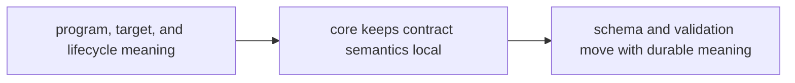

# Invariants

Invariants are the claims that must remain true for the package to stay worth trusting.

## Invariant Model

This page should make core invariants feel like contract anchors. Readers
should be able to see which meanings must survive implementation change for the
rest of the proteomics stack to keep its footing.

## Review Rules

- program, target, and lifecycle meanings remain explicit
- core owns contract semantics without absorbing runtime or policy decisions
- schema and validation surfaces move together when durable meaning changes

## First Proof Check

- `packages/bijux-proteomics-core/tests`
- `src/bijux_proteomics/program_spec.py` and `targets.py`
- `src/bijux_proteomics/lifecycle.py` and `validation.py`

## Design Pressure

Core invariants weaken when downstream-safe semantics turn into local coding
detail. The package has to keep contract meaning, lifecycle behavior, and proof
moving together.
