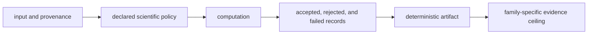

# Invariants

Core invariants protect scientific meaning across parsers, domain models,
identification, quantification, PTM, DIA, targeted analysis, benchmarks, and
public artifacts. They remain true even when implementations or performance
paths change.

## Scientific invariants

| Invariant | Required meaning | Violation example |
| --- | --- | --- |
| source lineage is retained | every imported row and derived record can be traced to producer, input, and transformation | external-engine output appears native |
| acceptance is explicit | accepted, rejected, refused, failed, and missing inputs remain distinguishable | invalid rows disappear from totals |
| units and orientation are declared | mass, time, intensity, ratio, probability, score direction, and thresholds have stable interpretation | larger becomes better after an adapter change without policy change |
| policy travels with results | FDR, normalization, missingness, inference, localization, calibration, and QC policy is reviewable | identical numbers hide different rules |
| target and decoy meaning is stable | labels, competition set, strata, orientation, and denominator are explicit | FDR changes because decoys were silently reclassified |
| missingness is not zero | absent, censored, filtered, failed, and numeric zero remain distinct when the workflow distinguishes them | imputation occurs through parsing convenience |
| deterministic inputs yield deterministic governed outputs | ordering, stable identifiers, serialization, and seeded behavior do not drift unexplained | parallel execution changes accepted record order or hash |
| workflow evidence does not transfer automatically | DDA, DIA, LFQ, multiplex, PTM, and targeted status are evaluated independently | a strong LFQ packet raises multiplex posture |
| computation and execution remain separate | Core owns scientific transformation; Runtime owns run state and retained execution | a scientific model declares operational success |
| evidence and recommendation remain separate | Core results can be grounded and judged without becoming their own citation or decision authority | a benchmark result writes its own recommendation posture |

## Cross-field invariants

Many failures are coherent field-by-field and wrong only in combination: a
threshold with the wrong score orientation, a localized site without protein
mapping, a ratio without channel identity, or a targeted result outside its
calibration range. Validation must protect relationships, not only types.

## Failure response

When an invariant fails, preserve the offending input, reason code, policy,
and affected counts. Reject or narrow the result. Do not repair scientific
meaning through undocumented defaults, silent row loss, fallback imputation,
or post hoc relabeling.
