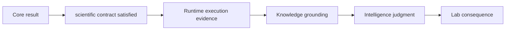

# Known limitations

Core contains substantial native scientific machinery, importers, benchmark
packages, and review artifacts. Its breadth is uneven across workflow families
and must not be read as universal raw-data processing, external-engine parity,
or decision-grade authority.

## Current scientific limits

| Limitation | Consequence | Responsible interpretation |
| --- | --- | --- |
| DDA’s strongest public lane imports external search-engine results | repository review does not reproduce the upstream database search | retain engine, version, parameters, database, and import provenance |
| DIA execution begins with checked report-level inputs | it does not establish chromatogram-native replay or universal library coverage | bound claims to the declared reports and library context |
| LFQ evidence is sensitive to design, normalization, missingness, and cohort transfer | repeatability on checked cohorts is not external quantitative truth | publish policy and transfer envelope with the result |
| multiplex transfer remains fragile | substantive models and executable fixtures still support only internal-use language | do not borrow status from LFQ or targeted workflows |
| PTM localization is stronger than functional interpretation | a localized site is not automatically causal, occupied, or regulatory | preserve ambiguity and route biological claims through evidence review |
| targeted workflows remain bounded by calibration, matrix, interference, carryover, and assay burden | executable QC is not universal vendor or laboratory transfer | retain panel, matrix, calibration, and readiness context |
| format adapters cover declared subsets and mutation fixtures | parsing one producer version does not prove all dialects | name producer, version, unsupported constructs, and rejected rows |
| checked benchmarks are finite and repository-governed | they cannot represent every instrument, sample, organism, or study design | state the evidence envelope and require outside data for broader claims |

## Boundary of a passing Core result

A passing Core result establishes only its declared scientific contract. It
does not establish that execution is reproducible, evidence is well grounded,
the recommendation is robust, or the proposed assay is feasible. Those are
separate owners and separate proof obligations.

## Report the envelope

Name the workflow family, input level, producer and version for imported data,
policy and parameters, benchmark assets, negative cases, and untested transfer
conditions. Use the current [workflow-family status](../../01-bijux-proteomics/foundation/workflow-families.md)
as the public ceiling; never widen it from code volume or test count alone.
