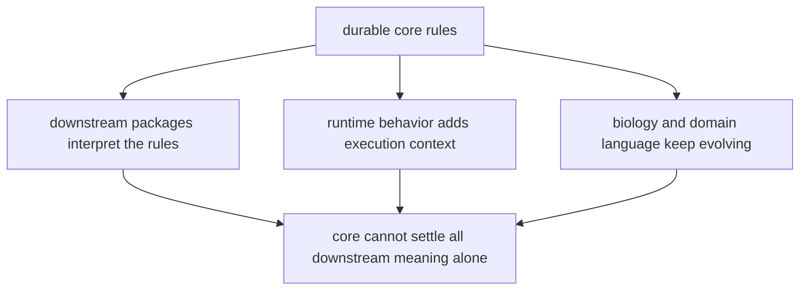

# Known Limitations

Known limitations matter because honest boundaries are part of quality, not an admission of failure.

For `bijux-proteomics-core`, limitations appear where durable rules meet interpretation, runtime behavior, and evolving scientific language outside the package’s direct control.

## Limitation Model

This page should make the package boundary honest: core owns durable rule shape, but it does not own every execution decision or every downstream interpretation of that rule.

## Review Rules

- core cannot prove downstream interpretation by itself
- runtime integration quality still depends on consuming packages
- biology terms need ongoing review to stay coherent across modules

## First Proof Check

- `packages/bijux-proteomics-core/tests`
- `src/bijux_proteomics/program_spec.py` and `targets.py`
- `src/bijux_proteomics/lifecycle.py` and `validation.py`

## Design Pressure

The easy mistake is to ask core to solve runtime ambiguity, policy choice, and evolving domain language all at once, which only hides where the real seam is.
