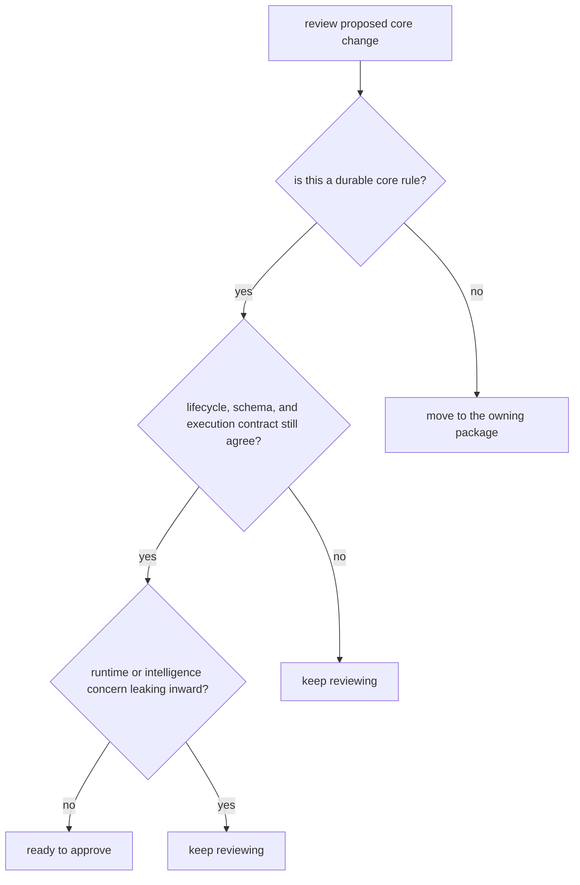

# Review Checklist

A review checklist is useful only if it catches the real ways this package can drift.

For `bijux-proteomics-core`, the first review question is whether the change belongs in durable contract space at all. Core gets expensive fast when nearby runtime or policy concerns leak inward.

## Review Model

This is a boundary checklist before it is a style checklist. If the owning rule is ambiguous, every downstream package ends up compensating differently.

## Review Rules

- ask whether the change belongs in durable contract space
- verify lifecycle, schema, and execution-contract surfaces still agree
- check whether runtime or intelligence concerns are leaking inward

## First Proof Check

- `packages/bijux-proteomics-core/tests`
- `src/bijux_proteomics/domain/program_spec.py` and `domain/targets.py`
- `src/bijux_proteomics/domain/lifecycle.py` and `domain/validation.py`

## Design Pressure

The failure here is approving a convenient local edit that turns one durable rule into several context-dependent interpretations.
