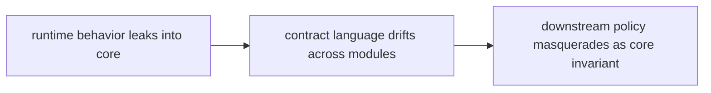

# Risk Register

A risk register should name the structural and behavioral failures that deserve ongoing attention.

## Risk Model

This page should make core risk feel like semantic erosion. The package is in
trouble when adjacent execution or downstream policy pressure starts rewriting
what core claims to mean.

## Review Rules

- runtime behavior hides inside core because it feels adjacent to execution rules
- contract language drifts across modules
- downstream policy starts masquerading as a core invariant

## First Proof Check

- `packages/bijux-proteomics-core/tests`
- `src/bijux_proteomics/program_spec.py` and `targets.py`
- `src/bijux_proteomics/lifecycle.py` and `validation.py`

## Design Pressure

Core risk grows when boundary pressure is explained away as adjacency. The
register has to keep semantic drift and policy leakage visible before they
harden into the package contract.
