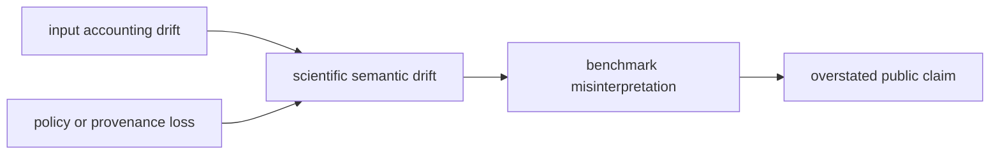

# Risk register

Core risk is scientific semantic erosion: software can remain executable while
input accounting, score meaning, provenance, or workflow claims become wrong.

| Risk | Early signal | Consequence | Required control |
| --- | --- | --- | --- |
| silent row loss | accepted totals change without matching rejection records | biased downstream evidence | field accounting, rejected rows, reason codes |
| score-orientation drift | adapter or dependency changes “better” direction | thresholds and FDR invert | orientation fixture, boundaries, reference values |
| target/decoy policy drift | labels, strata, competition, or denominator moves | error control becomes incomparable | serialized policy and sensitivity tests |
| missingness collapse | absent, censored, filtered, failed, and zero merge | quantification and contrasts are biased | explicit states and adversarial sparse fixtures |
| provenance loss | producer, version, parameters, database, or transformation disappears | imported output appears native or irreproducible | lineage invariant and artifact review |
| circular benchmark | implementation generates its own expected answer | regression evidence is mistaken for independent validation | external reference or independently specified truth |
| transfer overclaim | one corpus or workflow family sets broader posture | public language exceeds evidence | companion, holdout, and family-specific ceiling |
| nondeterministic optimization | chunking or parallelism changes order, acceptance, or hash | repeated runs disagree | serial equivalence and stable artifact tests |
| policy leakage | Runtime, Knowledge, Intelligence, or Lab rules move into Core | scientific functions depend on context outside their contract | dependency and ownership guards |
| format overclaim | one producer fixture is described as full standard support | unseen dialects parse incorrectly | producer/version scope and mutation corpus |

Silent acceptance drift, reversed score meaning, broken error control, lost
provenance, and benchmark circularity are release-blocking. A large green suite
does not reduce a risk whose relevant negative, reference, transfer, or
consumer evidence is absent.
