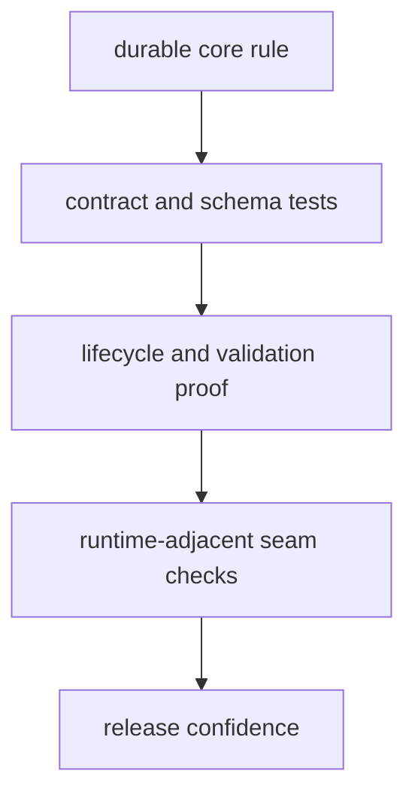

# Test Strategy

A useful test strategy names what evidence is needed and why shallow coverage is not enough.

For `bijux-proteomics-core`, the test story should show how one durable rule stays singular across contracts, lifecycle behavior, and runtime-adjacent seams.

## Strategy Model

This page should help a reader see why core tests exist in layers. The package becomes risky when proof of a rule is scattered across several test types but no page explains how they join up.

## Review Rules

- favor contract, lifecycle, and schema tests that explain the rule being defended
- cover runtime-adjacent seams where downstream drift is most likely
- prefer targeted proof of durable meaning over broad but vague regression suites

## First Proof Check

- `packages/bijux-proteomics-core/tests`
- `src/bijux_proteomics/domain/program_spec.py` and `domain/targets.py`
- `src/bijux_proteomics/domain/lifecycle.py` and `domain/validation.py`

## Design Pressure

The common mistake is to accumulate regression tests without proving that lifecycle, schema, and execution contracts still agree about the same rule.
