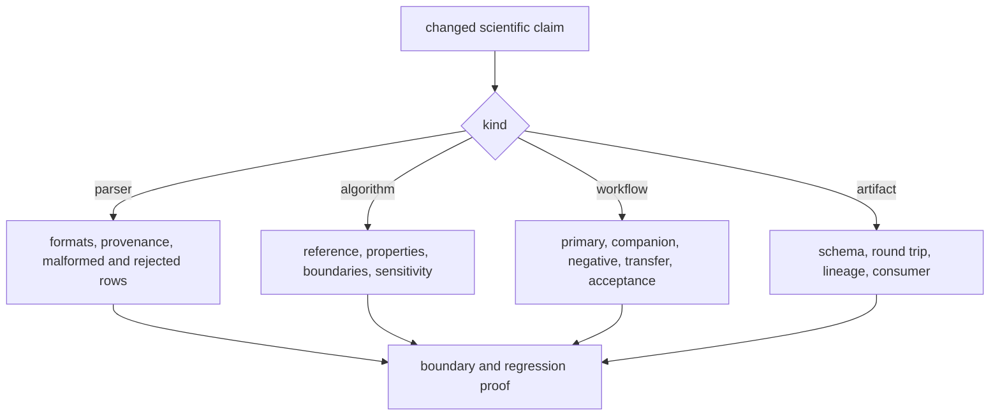

# Test strategy

Core testing selects evidence from the scientific claim. Unit coverage protects
local rules; public trust additionally needs malformed inputs, reference or
property evidence, benchmark challenge, provenance, and transfer limits.

## Evidence ladder

| Layer | Purpose | Typical evidence |
| --- | --- | --- |
| contract | construction, types, schema, reason codes, and lifecycle | domain and public-model tests |
| algorithm | equations, orientation, boundary values, invariants, and deterministic output | unit, parametrized, and property tests |
| adversarial input | malformed formats, contradictions, missingness, decoys, contaminants, and unsupported cases | parser mutation and negative-science corpora |
| reference | agreement with an independently specified value or implementation | reference fixtures and tolerance tests |
| regression | preserved behavior for a previously observed failure | minimal named fixture with expected disposition |
| benchmark | primary package, companion pressure, acceptance bars, provenance, and artifact review | workflow-family benchmark suites |
| transfer | behavior under changed cohort, matrix, library, engine, or design | holdout and generalization surfaces |
| boundary | schema, CLI/API parity, Runtime handoff, and downstream interpretation | package and cross-package tests |

## Select evidence by change



Run the focused domain or workflow suite first, then the complete Core suite
when shared models, public APIs, workflow posture, or cross-cutting helpers
move:

```bash
uv run --project packages/bijux-proteomics-core \
  pytest -q packages/bijux-proteomics-core/tests
```

## Independence and circular proof

A benchmark generated by the changed algorithm cannot independently validate
that algorithm. A parity test that compares two adapters over the same imported
producer output establishes adapter agreement, not independent scientific
truth. Record the origin of expected values and separate reference evidence
from regression snapshots.

## Performance and determinism

For chunking, parallelism, vectorization, or caching, pair resource evidence
with serial equivalence, stable ordering, partial-failure behavior, and artifact
identity. Faster output that changes accepted records or provenance is a
scientific regression.
