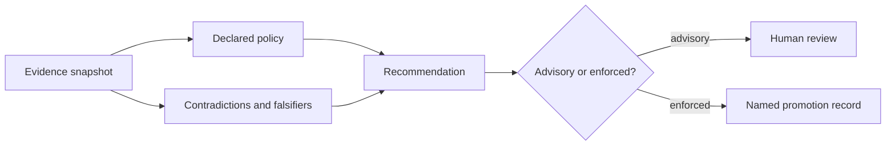

# Architecture Risks

Intelligence becomes unsafe when a policy-dependent recommendation is presented as an objective property of a candidate or as authority to act.

| Risk | Consequence | Control |
| --- | --- | --- |
| Score reification | A composite score is treated as intrinsic truth | Bind every score to metric definitions, weights, cohort, evidence, and policy |
| Cohort instability | Rank changes because candidates were added or removed | Fingerprint the comparison set and report ranking stability |
| Hidden threshold drift | Policy changes alter recommendations without visible review | Version thresholds and retain policy identity in outputs |
| Correlated evidence | Repeated or dependent evidence is counted as independent support | Preserve sources, overlap, and triangulation limits |
| Contradiction suppression | Favorable evidence dominates because adverse evidence is summarized away | Run contradiction, falsifier, and skeptical-review passes before recommendation |
| Confidence inflation | Model confidence is confused with evidence adequacy | Audit overconfidence, underconfidence, spread, and evidence gates separately |
| Explanation laundering | Fluent rationale hides missing provenance or unresolved questions | Require report contracts and source-linked reasons |
| Automation bias | Advisory output is executed without accountable promotion | Keep advisory mode as default and require named policy promotion |
| Outcome leakage | Later outcomes are allowed to rewrite the historical decision basis | Append learning records and preserve the original snapshot |

A sophisticated ranking is still bounded decision support. Review quality depends on seeing where the result is sensitive, conflicted, incomplete, or contingent—not only why the leading candidate scored well.
