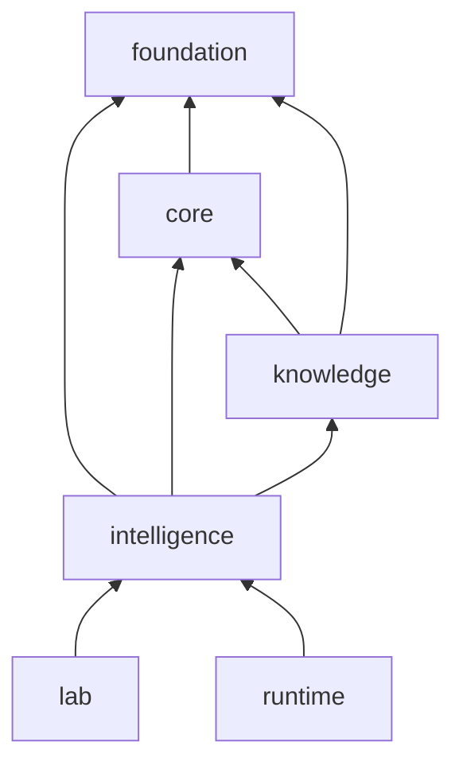

# Dependency Direction

Intelligence is a policy layer over foundation contracts, core scientific results, and knowledge records. Those are required dependencies. Lab and runtime may consume intelligence outputs, but intelligence does not import either package.

## Boundary rules

- Candidate and judgment code may refer to foundation identifiers, core scientific contracts, and knowledge evidence records.
- Interpretation modules project existing analytical results into decision context; they do not reimplement identification, quantification, enrichment, or PTM calculations.
- Review packets describe inputs, policy, challenge results, and recommendations. They are not an alternative evidence database.
- Laboratory plans and operational run state remain downstream. A recommendation can be consumed by those packages only through an explicit handoff.
- NumPy supports numerical comparison and Pydantic validates contracts; neither is a source of hidden policy defaults.

## Policy ownership

Decision thresholds, scenarios, ranking criteria, refusal conditions, and recommendation vocabulary belong here because changing them can change a decision even when evidence is unchanged. Evidence content and scientific algorithms remain in their source owners. This separation allows a review to answer two different questions: “Did the analysis produce this evidence?” and “Given the declared policy, why did this evidence lead to this recommendation?”

## Preventing authority leakage

An intelligence result must not masquerade as laboratory approval, workflow completion, or verified truth. Downstream code must preserve its recommendation status and the policy version that produced it. Conversely, intelligence must not infer success from runtime completion: a process can finish successfully while the resulting evidence is weak, contradictory, or insufficient for a decision.
