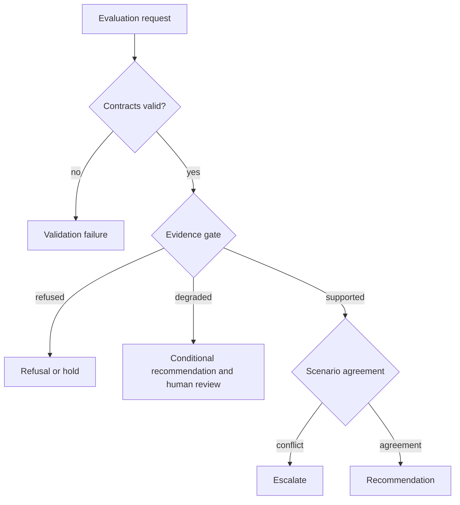

# Error Model

Intelligence outcomes distinguish invalid evaluation, governed refusal, uncertainty-driven hold, and successful recommendation. Only the first is necessarily a software or contract error.

| Outcome | Meaning | Required evidence |
| --- | --- | --- |
| Invalid input | Candidate, policy, scenario, or evidence contract cannot be evaluated | Validation issues naming the affected field or record |
| Refused claim | A strong claim fails design, QC, peptide-support, or localization thresholds | Stable refusal reason and minimum missing evidence |
| Hold | Evaluation is valid, but contradiction, uncertainty, or evidence readiness blocks action | Hold pressure, downgrade chain, unresolved questions, and gate result |
| Human escalation | Scenarios conflict or confidence spread exceeds policy | Escalation flags and the competing scenario outcomes |
| Degraded recommendation | A recommendation exists with material caveats | Degradation reasons and required review |
| Recommendation | Policy supports one action | Evidence snapshot, candidate cohort, policy, sensitivity, and rationale |

The absence of a recommendation is not a crash, and a completed calculation is not necessarily decision success. Errors must not be “handled” by substituting neutral scores, dropping candidates, resolving ties arbitrarily, or suppressing missing evidence. Those behaviors would turn uncertainty into false precision.

## Route the outcome to its authority

| Outcome | Accountable response | Closure evidence |
| --- | --- | --- |
| invalid candidate, policy, scenario, or evidence contract | data or policy owner corrects the named contract | corrected identity plus validation result; unchanged retry is not closure |
| evidence refusal | Knowledge or scientific owner supplies the missing burden or accepts a narrower claim | new evidence-bundle identity, sufficiency decision, or explicit refusal acceptance |
| hold | decision owner waits for the named resolving event | hold condition, expiry or review trigger, and resulting disposition |
| human escalation | named domain, safety, cost, or operational authority decides the contested dimension | competing outcomes, owner, rationale, conditions, and decision time |
| degraded recommendation | consumer preserves caveats and satisfies required review before use | accepted limitations, allowed use, reviewer, and downstream restrictions |
| recommendation | accountable human or governed promotion policy decides whether action may proceed | recommendation identity, authority decision, conditions, and handoff target |

No row authorizes Intelligence to manufacture missing evidence or operational
approval. If the named authority does not respond, the durable state remains a
hold, escalation, or refusal rather than silently aging into approval.
