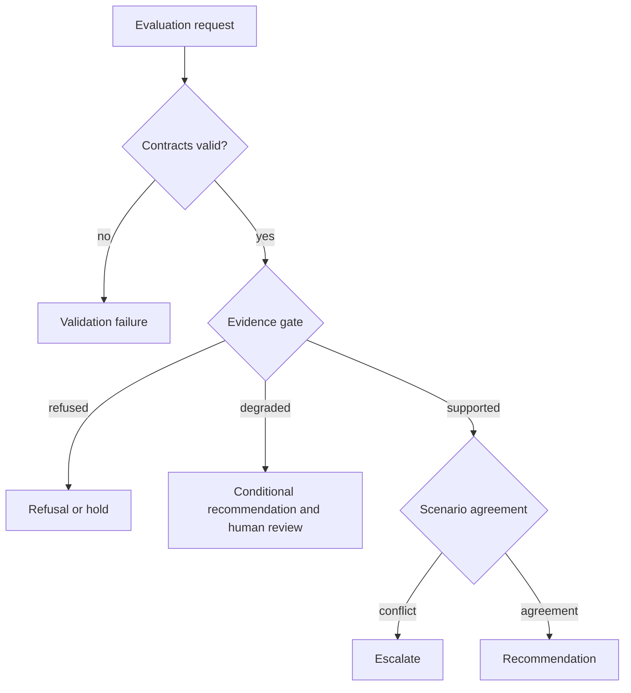

# Error Model

Intelligence outcomes distinguish invalid evaluation, governed refusal, uncertainty-driven hold, and successful recommendation. Only the first is necessarily a software or contract error.

| Outcome | Meaning | Required evidence |
| --- | --- | --- |
| Invalid input | Candidate, policy, scenario, or evidence contract cannot be evaluated | Validation issues naming the affected field or record |
| Refused claim | A strong claim fails design, QC, peptide-support, or localization thresholds | Stable refusal reason and minimum missing evidence |
| Hold | Evaluation is valid, but contradiction, uncertainty, or evidence readiness blocks action | Hold pressure, downgrade chain, unresolved questions, and gate result |
| Human escalation | Scenarios conflict or confidence spread exceeds policy | Escalation flags and the competing scenario outcomes |
| Degraded recommendation | A recommendation exists with material caveats | Degradation reasons and required review |
| Recommendation | Policy supports one action | Evidence snapshot, candidate cohort, policy, sensitivity, and rationale |

The absence of a recommendation is not a crash, and a completed calculation is not necessarily decision success. Errors must not be “handled” by substituting neutral scores, dropping candidates, resolving ties arbitrarily, or suppressing missing evidence. Those behaviors would turn uncertainty into false precision.
