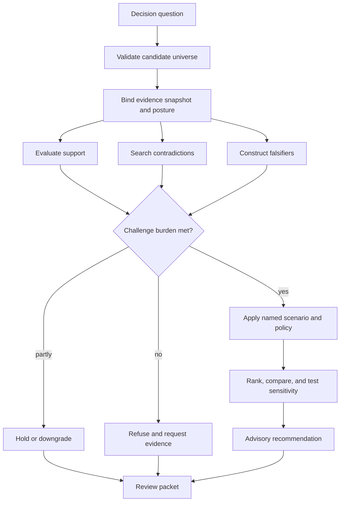
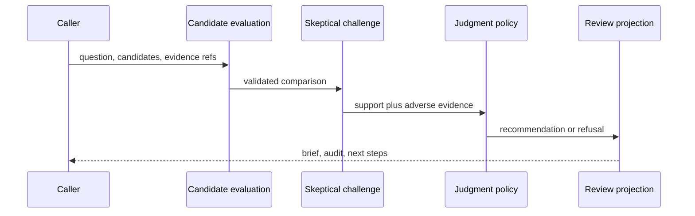

# Execution Model

An intelligence evaluation is a recorded argument, not an opaque score. It starts with a decision question and candidate set, binds the relevant evidence, applies declared policy, actively searches for reasons to withhold confidence, and emits a reviewable recommendation or refusal.

## Evaluation stages

Candidate validation establishes identity, comparable fields, quality, and lifecycle state. Evidence posture records what kinds of support are present and how directly they bear on the decision. Contradiction and falsifier passes expose adverse evidence before ranking rather than appending caveats afterward.

Judgment then applies an explicit policy in a named scenario. Ranking is meaningful only within that policy: weights, gates, uncertainty treatment, and ties are part of the result. A recommendation must retain the candidate fingerprint, evidence references, policy identity, decisive criteria, sensitivity, and reasons alternatives were not selected.

| Decision state | Minimum retained reason | Permitted reader conclusion |
| --- | --- | --- |
| recommend | challenge burden met; preferred action stable enough under declared policy | the policy prefers this action under this evidence snapshot |
| hold | a named dependency, review, or observation is unresolved | no action is justified until the condition closes |
| downgrade | an action remains discussable but support or stability is weaker | confidence and claim strength must be narrowed |
| refuse | a gate, evidence boundary, or validity condition failed | the requested recommendation is not available |

None of these states independently authorizes laboratory execution.

## Review path

Decision briefs and outsider packets make the same reasoning available at different review depths. Independent-rerun and benchmark modules test whether the outcome can be reproduced and whether policy behavior remains calibrated across blinded cases, counterfactuals, sensitivity changes, and regret analyses.

## Learning without silent drift

Outcome feedback may propose adaptation, but it cannot rewrite an active decision retroactively or mutate policy invisibly. Learning records connect reviewed outcomes to a declared policy change. Existing packets retain the policy and evidence snapshot under which they were produced, so later improvements do not erase the historical basis of a decision.

Policy comparison must produce a new record rather than overwrite the old
recommendation. A reviewer can then distinguish a changed evidence snapshot,
a changed candidate universe, and a changed policy—three different causes of
recommendation movement.
