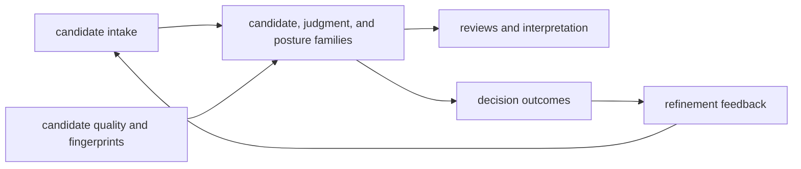

# Architecture

`bijux-proteomics-intelligence` architecture should make judgment legible. This
section is where a reader should understand how candidates become ranked,
judged, reviewed, and turned into recommendation outcomes without pretending
that judgment is the same thing as evidence truth.

## What Makes This Architecture Distinct

- it is allowed to judge, rank, and explain
- it is not allowed to redefine evidence truth or execute lab work
- the feedback loop matters because recommendation quality is learned over time,
  not frozen in one score pass

## Start With

- open [Execution Model](https://bijux.io/bijux-proteomics/05-bijux-proteomics-intelligence/architecture/execution-model/)
  when the question is how inputs move through policy into recommendation output
- open [Integration Seams](https://bijux.io/bijux-proteomics/05-bijux-proteomics-intelligence/architecture/integration-seams/)
  when a proposed change starts to smell like evidence semantics or execution
  control
- open [Module Map](https://bijux.io/bijux-proteomics/05-bijux-proteomics-intelligence/architecture/module-map/)
  when you need the owning family for candidates, judgment, reviews, interpretation, or learning

## Reader Routes

- for scoring mechanics:
  [Execution Model](https://bijux.io/bijux-proteomics/05-bijux-proteomics-intelligence/architecture/execution-model/)
  and [Dependency Direction](https://bijux.io/bijux-proteomics/05-bijux-proteomics-intelligence/architecture/dependency-direction/)
- for explainability surfaces:
  [State and Persistence](https://bijux.io/bijux-proteomics/05-bijux-proteomics-intelligence/architecture/state-and-persistence/)
  and [Code Navigation](https://bijux.io/bijux-proteomics/05-bijux-proteomics-intelligence/architecture/code-navigation/)
- for future scoring or report extensions:
  [Extensibility Model](https://bijux.io/bijux-proteomics/05-bijux-proteomics-intelligence/architecture/extensibility-model/)
  and [Architecture Risks](https://bijux.io/bijux-proteomics/05-bijux-proteomics-intelligence/architecture/architecture-risks/)

## First Proof Check

- `src/bijux_proteomics_intelligence/candidates/` for candidate inputs and quality framing
- `src/bijux_proteomics_intelligence/judgment/` and `posture/` for ranking, scenario, and refusal structure
- `src/bijux_proteomics_intelligence/reviews/`, `interpretation/`, and `learning/` for downstream analytical projection and refinement pressure

## Boundary Test

If a recommendation cannot be explained as a policy result with named inputs,
the architecture is too opaque for the role this package claims.
