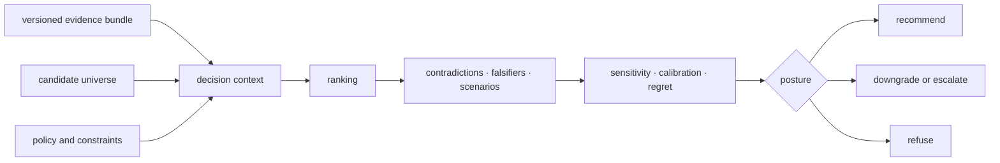
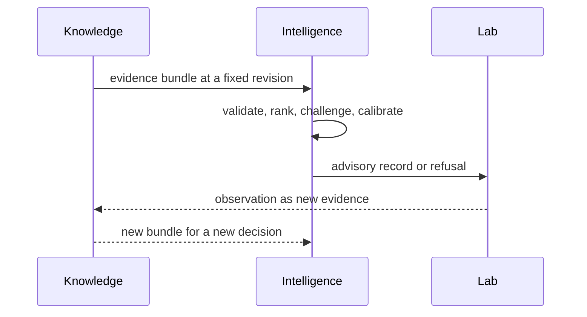

# Decision architecture

`bijux-proteomics-intelligence` makes analytical judgment reproducible without
pretending judgment is evidence truth. It validates a candidate universe,
applies a named policy, challenges the ranking, measures sensitivity and
regret, then emits an advisory recommendation, downgrade, escalation, or
refusal.

## Responsibility map

| Family | Owns | Retains for review |
| --- | --- | --- |
| `candidates` | candidate models, validation, metrics, filtering, ranking, selection, lifecycle | complete universe, exclusions, fingerprints, score components |
| `claims` | claim-support interrogation | evaluated claim and immutable evidence references |
| `interpretation` | bounded analytical readings | assumptions, context, caveats, computed versus inferred content |
| `judgment` | policies, scenarios, recommendations, counterfactuals, sensitivity, confidence, regret | policy identity, alternatives, reversals, uncertainty |
| `posture` | evidence posture and skeptical review | downgrade, escalation, and human-review conditions |
| `reviews` | benchmark reviews, decision briefs, outsider packets, public scrutiny | input lineage, challenge results, unresolved pressure |
| `learning` | adaptation, refinement, convergence, stagnation | triggering outcomes and prior policy identity |

The [module map](module-map.md) identifies concrete owners and
[dependency direction](dependency-direction.md) keeps evidence custody and
laboratory authority outside the package.

## Decision context is immutable input

Outcome learning produces a new calibration or policy record. It never edits
the evidence bundle or recommendation that existed before the observation.
[State and persistence](state-and-persistence.md) defines this history.

## Ranking is policy, not fact

A ranking combines declared values: objectives, weights, constraints,
thresholds, tie-breaking, missing-data treatment, and feasibility assumptions.
Two valid policies may rank the same evidence differently. The architecture
therefore preserves component scores and competing candidates rather than only
the winner.

[Execution model](execution-model.md) traces candidate intake through posture.
The resulting record is explainable only when another reviewer can recompute
the ordering from the same decision context.

## Challenge before recommendation

Challenge is part of the decision path, not an optional report. Contradictions,
falsifiers, blinded evidence, plausible alternative scenarios, threshold
sensitivity, and regret test whether the ranking is stable enough for its
declared use. An unstable result is downgraded, escalated, or refused even when
its nominal score is high.

## Extension rules

A new metric belongs with candidate quality; a new policy belongs with
judgment; a new skeptical test belongs with challenge or posture; a new review
artifact composes existing records without becoming an alternative policy
engine. Every extension identifies its inputs, policy, deterministic behavior,
failure modes, and authority limit.

Use [extensibility model](extensibility-model.md) before adding a capability,
[integration seams](integration-seams.md) for evidence and Lab handoffs, and
[error model](error-model.md) for refusal and invalid decision contexts.

## Architectural risks

The most serious risks are incomplete candidate universes, hidden exclusions,
policy defaults that change without identity, scores presented without
components, explanations generated from different inputs than the decision,
and feedback that rewrites history. Duplicate decision models and broad owner
facades also weaken accountability. [Architecture risks](architecture-risks.md)
and [code navigation](code-navigation.md) provide the focused review paths.
