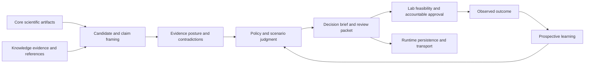

# Integration Seams

Intelligence is the advisory layer between scientific evidence and accountable
review. It consumes typed analysis and curated context, makes policy-driven
judgment explicit, and emits recommendations that downstream lab systems may
consider but must never execute implicitly.

## Seam obligations

| Seam | Upstream obligation | Intelligence obligation |
| --- | --- | --- |
| Core → intelligence | provide valid scientific models, design and QC state, claims, uncertainty, and provenance | evaluate without renormalizing measurements or inventing missing scientific support |
| Knowledge → intelligence | provide evidence graph, source context, trust, freshness, contradiction, and caveat state | preserve identifiers and adverse evidence; do not curate sources locally |
| Intelligence → review | provide policy identity, factor contributions, rankings, scenario outcomes, refusals, falsifiers, uncertainty, and alternatives | reviewer records accountable disposition and rationale |
| Intelligence → lab | provide a bounded recommendation and named evidence gaps | lab re-evaluates assay risk, controls, materials, capacity, and execution authority |
| Runtime ↔ intelligence | transport typed inputs and persist outputs with lineage | keep judgment deterministic and free of workspace, provider, retry, and credential concerns |
| Lab outcome → learning | provide attributable observations and outcomes | adapt future posture without rewriting historical decisions |

## Authority boundary

An `advance` or `scale_up` scenario result is an analytical recommendation, not
authorization. Readiness scores, confidence, and candidate rank cannot stand in
for a review-board decision, a lab handoff, or local safety approval. The lab
package owns the operational translation and can refuse a recommendation that
is scientifically interesting but infeasible or unsafe.

Learning is similarly one-directional in time. An outcome can inform a new
policy or refinement run, but the package must retain the policy, evidence, and
rationale used for the earlier decision. This separation makes regret and drift
measurable instead of silently revising history.

## Contract change impact

When core changes a claim or metric, review candidate validation, claim support,
refusal thresholds, interpretation, scenario coverage, and benchmark packets.
When knowledge changes evidence state, review freshness, contradictions,
belief audits, recommendations, and decision briefs. When intelligence changes
a policy, fingerprint and compare rankings, scenarios, counterfactuals,
sensitivity, and review outputs before downstream consumers adopt it.
