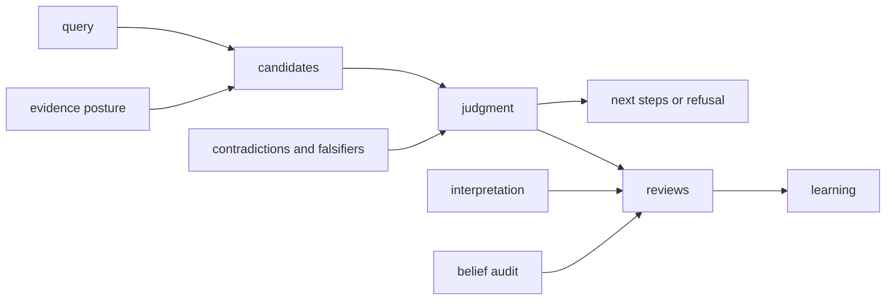

# Module Map

`bijux-proteomics-intelligence` turns evidence into inspectable decision support. It owns candidate comparison, skeptical challenge, policy-governed judgment, and reviewer-facing explanations; it does not create experimental evidence or authorize laboratory execution.

## Owner modules

| Family | Responsibility |
| --- | --- |
| `candidates` | Candidate schemas, records, validation, quality, fingerprints, filters, ranking, selection, lifecycle, and stores |
| `claims`, `posture` | Claim support and the explicit evidential stance used for evaluation |
| `contradictions`, `falsifiers`, `belief_audit` | Adverse evidence, disconfirmation tests, and traceable changes in belief |
| `judgment` | Policies, scenarios, decision paths, recommendations, and decision benchmark suites |
| `interpretation` | Decision-facing projections of quantitative, pathway, PTM, contaminant, run, contrast, and structural evidence |
| `next_steps`, `refusal` | Bounded follow-up actions and explicit non-recommendation when prerequisites fail |
| `reviews` | Decision briefs, boards, outsider packets, rerun kits, public-scrutiny records, and workflow-authority contracts |
| `learning` | Controlled adaptation from reviewed outcomes rather than silent policy mutation |
| `query`, `governance` | Decision-question contracts and package charter constraints |

The package root lazily exposes these fourteen owner modules. Concrete types and functions remain under their owner, which keeps ranking, interpretation, and review APIs distinguishable.

## What intelligence does not own

Core owns scientific calculations. Knowledge owns durable evidence memory and source grounding. Lab owns experimental planning and readiness. Runtime owns processes, services, artifacts, and operational state. Intelligence may consume records from all appropriate lower layers and emit a recommendation packet, but a recommendation is neither new evidence nor an execution command.
