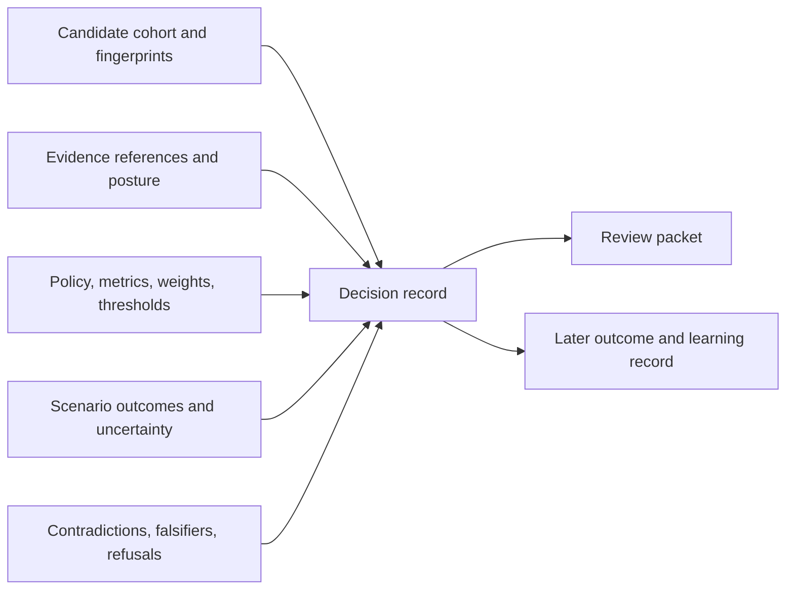

# State and Persistence

An intelligence record is reproducible only when it preserves the complete basis of the judgment, not merely the selected action.

## Durable decision state

- candidate identities, fingerprints, lifecycle states, cohort membership, exclusions, and quality signals;
- evidence references, provenance, freshness, gaps, contradiction state, and readiness result;
- policy identity, metric catalog, weights, thresholds, scenario assumptions, and evaluation time;
- per-scenario action, confidence, hypothesis status, and unresolved questions;
- ranking, ties, robustness, stability, sensitivity, drift, and provenance reports;
- recommendation or refusal, reasons, downgrade chain, gate result, escalation flags, and human-review requirement;
- advisory or enforced mode, including promoter, policy identifier, and rationale;
- review packets, belief audits, challenge results, and later learning records.

## Storage boundary

Candidate stores and artifact records support package workflows, but service persistence remains a runtime concern. Knowledge evidence is referenced rather than copied into an intelligence-owned source of truth. Lab outcomes can be linked for learning without becoming retroactive inputs to an older recommendation.

Decision records should be append-only in meaning: corrections or new evidence create a superseding evaluation. Keeping old policy and evidence snapshots allows reviewers to distinguish a changed world from a changed model.

## Record supersession explicitly

| Supersession cause | New record must identify | Historical record retains |
| --- | --- | --- |
| corrected candidate data | corrected fields, source, affected candidates, and validation | original cohort, exclusions, and scores |
| changed evidence | prior and current Knowledge bundle identities plus relationship changes | evidence snapshot and sufficiency state used at decision time |
| changed policy | prior and current policy identities, changed constraints or weights, and approval | original objectives, thresholds, tie-breakers, and rationale |
| expanded scenario burden | added or removed scenarios, falsifiers, and sensitivity ranges | outcomes under the earlier challenge envelope |
| human override | accountable actor, authority, rationale, conditions, and expiry | computed recommendation and required review state |
| observed consequence | linked Lab consequence and declared learning rule | recommendation as issued before the outcome existed |

A “latest” projection may select the active record, but it must remain possible
to reconstruct the chain and compare like-for-like dimensions. Deleting an
earlier recommendation destroys evidence about calibration, policy drift, and
the cost of past decisions.
