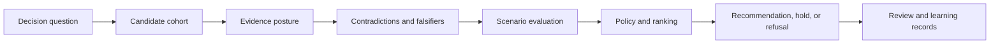

# Capability Map

`bijux-proteomics-intelligence` evaluates candidates and scenarios under declared decision policy. Its outputs are inspectable recommendations, refusals, escalation signals, and review packets—not autonomous decisions or newly manufactured evidence.

## Decision capabilities

| Capability | What remains visible |
| --- | --- |
| Candidate preparation | schema validation, fingerprints, quality, filters, lifecycle state, cohort membership |
| Ranking and selection | policy, criteria, scores, ties, exclusions, and selected candidates |
| Evidence posture | support strength, gaps, provenance, readiness, and the distinction between evidence and interpretation |
| Skeptical challenge | contradictions, falsifiers, alternative explanations, and belief audits |
| Scenario reasoning | progression, synthesis, scale-up, and redesign outcomes with confidence and unresolved questions |
| Recommendation | action, reasons, downgrade chain, gate result, and human-review requirement |
| Refusal | stable reason and minimum missing evidence when a strong claim or action is unsupported |
| Review | decision briefs, boards, outsider packets, rerun kits, public-scrutiny records, and release candidates |
| Evaluation | blinded challenges, counterfactuals, confidence calibration, sensitivity, quality, and regret |
| Learning | reviewed adaptation proposals tied to outcomes rather than silent policy mutation |

Intelligence can compare what would happen under different assumptions and policies. It cannot certify source truth, perform the underlying proteomics analysis, allocate laboratory resources, or execute a workflow. Those boundaries keep a recommendation reversible and reviewable.
