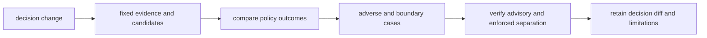

# Change Principles

An Intelligence change is safe only when a reviewer can determine whether it
changed evidence use, candidate eligibility, decision policy, uncertainty,
refusal, explanation, or downstream authority. Schema compatibility alone is
not enough: a recommendation can reverse while the payload shape stays fixed.

## Classify the decision change

| Changed surface | Questions to answer | Required evidence |
| --- | --- | --- |
| candidate or filter | Who entered, who was excluded, and can ordering or selection change? | fixed cohort, rejection cases, and before/after ranking |
| score or orientation | What does the value mean, in which direction, on which scale, and under missingness? | boundary values, monotonicity, ties, and missing inputs |
| weight or threshold | Which decisions move under the new policy? | policy identity, sensitivity envelope, and decision diff |
| confidence or calibration | Which corpus and outcome definition support the value? | calibration, drift, subgroup, and abstention evidence |
| contradiction or falsifier | Can favorable evidence bypass challenge? | adverse, ambiguous, and unresolved cases |
| scenario or regret | Which alternatives, costs, and uncertainties are modeled or omitted? | counterfactual and consequence fixtures |
| refusal or hold | Which blocker stops progression, and can a caller flatten it? | refusal reason, consumer branch, and rendered packet |
| promotion | Who grants authority, to what target, under which policy? | attributable promotion and unauthorized-path rejection |
| learning | Which outcomes are eligible to alter future policy? | lineage, eligibility, audit, and preserved prior decision |

## Invariants

- evidence identity and candidate scope are explicit before ranking;
- score orientation, missingness, ties, and thresholds never rely on caller
  inference;
- challenge evidence can downgrade, hold, or refuse a favorable result;
- confidence is not described as probability beyond its calibration evidence;
- rejected candidates, alternatives, and unresolved questions remain visible;
- advisory output cannot become enforced through serialization or transport;
- new evidence or policy supersedes rather than rewrites history; and
- feedback changes future policy only through an attributable review record.

Review the same evidence and candidate set under both policies whenever a
change can affect judgment. If the recommendation moves, publish the decisive
factor and downstream consequence. If the proof does not cover the new policy
envelope, narrow the posture or refuse it.
