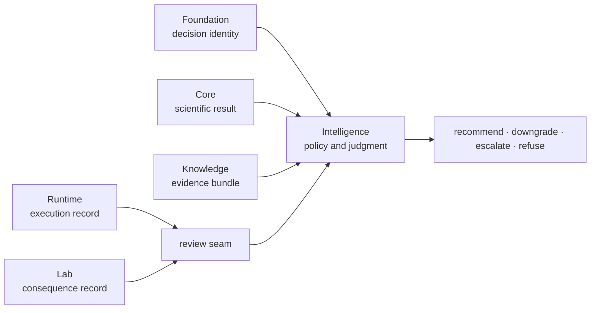

# Dependencies and adjacencies

Intelligence declares Foundation, Core, and Knowledge as product prerequisites:
shared documents preserve decision identity, Core defines scientific inputs,
and Knowledge supplies evidence custody. Narrow review surfaces also consume
Runtime and Lab records so a recommendation can be challenged against execution
and downstream consequence without moving those meanings into decision policy.

## Prerequisite contract

| Dependency | Intelligence consumes | It must not redefine |
| --- | --- | --- |
| Foundation | candidate, claim, program, and review identities; canonical records | cross-package identity or serialization rules |
| Core | scientific outputs, QC, acceptance posture, and domain constraints | calculations, thresholds, or workflow meaning |
| Knowledge | sources, support, contradiction, gaps, and evidence sufficiency | evidence history or truth relationships |
| NumPy | numerical ranking, sensitivity, and scenario calculations | policy identity or explanation semantics |
| Pydantic | strict decision and review records | human authority or scientific validity |

## Review adjacencies

Runtime and Lab appear in outsider review, independent-rerun, release-candidate,
and workflow-authority surfaces. These records apply pressure to a decision:

| Adjacent record | Decision question | Authority retained by neighbor |
| --- | --- | --- |
| Runtime run bundle | did the evidence-producing work execute under the claimed conditions? | provider, state, artifacts, comparison, and replay |
| Lab readiness record | is the proposed action feasible and controlled? | readiness, custody, scheduling, and refusal |
| Lab consequence record | did the observed outcome support, contradict, or leave the action unresolved? | measurement, QC, deviation, and outcome identity |

Intelligence may change a ranking or posture in response. It may not edit the
run or lab record to make the decision appear stable.

## Dependency placement rules

| Proposed behavior | Correct owner |
| --- | --- |
| scientific calculation or acceptance threshold | Core |
| source curation, contradiction, or evidence sufficiency | Knowledge |
| ranking, scenario, counterfactual, regret, confidence, or refusal policy | Intelligence |
| provider, checkpoint, retry, execution state, or artifact transport | Runtime |
| assay readiness, scheduling, handoff, observation, or consequence | Lab |

## Review the edge

For any new dependency or imported record, verify that:

1. its owner and immutable identity remain present in the decision record;
2. missing upstream evidence or consequence can trigger downgrade or refusal;
3. the ranking policy is reproducible without private state from the neighbor;
4. explanation distinguishes evidence movement from policy movement;
5. review-only integration does not become a circular core dependency.

Use [decision foundations](package-overview.md),
[recommendation challenges](workflow-recommendation-challenges.md), and
[dependency governance](../quality/dependency-governance.md) for deeper review.
