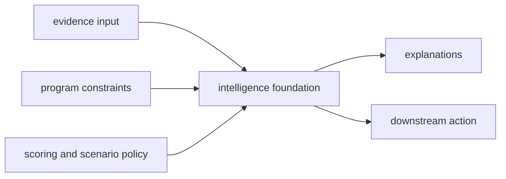

# Foundation

The foundation section explains the durable role of `bijux-proteomics-intelligence` before it
explains implementation detail. Use it to resolve why decision policy belongs here without pretending to own evidence truth or execution.

That boundary needs more explicit language now because the repository has
enough benchmark, workflow, and grounding depth that analytical judgment can no
longer hide behind vague prose. This section exists to show where
recommendation posture begins, how challenge evidence disciplines that posture,
and why explanation must stay visibly downstream from scientific truth.

## What This Section Protects

- a visible seam between fact and judgment
- recommendation logic that can be argued about instead of merely obeyed
- explanation surfaces that stay tied to policy rather than pretending to be
  raw evidence

## What This Section Now Carries

- recommendation posture that remains separate from evidence truth
- challenge and confidence routes that expose overconfidence, underconfidence,
  and regret instead of smoothing them away
- explanation surfaces that justify analytical judgment without pretending to
  be upstream fact

## Start With

- Open [Package Overview](https://bijux.io/bijux-proteomics/05-bijux-proteomics-intelligence/foundation/package-overview/) for the shortest statement of
  the package role.
- Open [Ownership Boundary](https://bijux.io/bijux-proteomics/05-bijux-proteomics-intelligence/foundation/ownership-boundary/) when the question is
  whether a change belongs here or in a neighbor.
- Open [Scope and Non-Goals](https://bijux.io/bijux-proteomics/05-bijux-proteomics-intelligence/foundation/scope-and-non-goals/) when a proposed change
  risks broadening the package.
- Open [Capability Map](https://bijux.io/bijux-proteomics/05-bijux-proteomics-intelligence/foundation/capability-map/) when you need the concrete work
  the package is allowed to do.
- Open [This Package Does Not Own](https://bijux.io/bijux-proteomics/05-bijux-proteomics-intelligence/this-package-does-not-own/)
  when a proposal is trying to recast recommendation policy as scientific truth
  or runtime control.
- Open [Workflow Recommendation Challenges](https://bijux.io/bijux-proteomics/05-bijux-proteomics-intelligence/foundation/workflow-recommendation-challenges/)
  when you need the current blinded recommendation record rather than summary language.
- Open [Workflow Recommendation Confidence](https://bijux.io/bijux-proteomics/05-bijux-proteomics-intelligence/foundation/workflow-recommendation-confidence/)
  when you need the current counterfactual, overconfidence, underconfidence, and regret surfaces.

## Section Pages

- [Package Overview](https://bijux.io/bijux-proteomics/05-bijux-proteomics-intelligence/foundation/package-overview/)
- [Scope and Non-Goals](https://bijux.io/bijux-proteomics/05-bijux-proteomics-intelligence/foundation/scope-and-non-goals/)
- [Ownership Boundary](https://bijux.io/bijux-proteomics/05-bijux-proteomics-intelligence/foundation/ownership-boundary/)
- [This Package Does Not Own](https://bijux.io/bijux-proteomics/05-bijux-proteomics-intelligence/this-package-does-not-own/)
- [Capability Map](https://bijux.io/bijux-proteomics/05-bijux-proteomics-intelligence/foundation/capability-map/)
- [Workflow Recommendation Challenges](https://bijux.io/bijux-proteomics/05-bijux-proteomics-intelligence/foundation/workflow-recommendation-challenges/)
- [Workflow Recommendation Confidence](https://bijux.io/bijux-proteomics/05-bijux-proteomics-intelligence/foundation/workflow-recommendation-confidence/)
- [Dependencies and Adjacencies](https://bijux.io/bijux-proteomics/05-bijux-proteomics-intelligence/foundation/dependencies-and-adjacencies/)
- [Repository Fit](https://bijux.io/bijux-proteomics/05-bijux-proteomics-intelligence/foundation/repository-fit/)
- [Lifecycle Overview](https://bijux.io/bijux-proteomics/05-bijux-proteomics-intelligence/foundation/lifecycle-overview/)
- [Domain Language](https://bijux.io/bijux-proteomics/05-bijux-proteomics-intelligence/foundation/domain-language/)
- [Change Principles](https://bijux.io/bijux-proteomics/05-bijux-proteomics-intelligence/foundation/change-principles/)

## What This Section Settles

- when a rule is a judgment policy rather than a knowledge claim
- which recommendation behavior belongs here before runtime or lab acts on it
- when a proposed change is really about evidence truth or workflow rules and
  should leave this package

## Strongest Intelligence Proof

- start with
  [Workflow Recommendation Challenges](https://bijux.io/bijux-proteomics/05-bijux-proteomics-intelligence/foundation/workflow-recommendation-challenges/)
  when the dispute is whether recommendation posture survives blinded pressure
- continue to
  [Workflow Recommendation Confidence](https://bijux.io/bijux-proteomics/05-bijux-proteomics-intelligence/foundation/workflow-recommendation-confidence/)
  when the question is where confidence, regret, and counterfactual weakness
  still remain
- open
  [This Package Does Not Own](https://bijux.io/bijux-proteomics/05-bijux-proteomics-intelligence/this-package-does-not-own/)
  when someone is trying to rename scientific truth or runtime control as
  intelligence policy

## First Proof Check

- `packages/bijux-proteomics-intelligence/src/bijux_proteomics_intelligence`
- `packages/bijux-proteomics-intelligence/tests`
- neighboring handbooks once the change crosses the local boundary

## Neighbors

- Open [bijux-proteomics-knowledge](https://bijux.io/bijux-proteomics/06-bijux-proteomics-knowledge/)
  when the question leaves scoring, ranking, scenarios, and explanations.
- Open [bijux-proteomics-core](https://bijux.io/bijux-proteomics/04-bijux-proteomics-core/)
  when the issue is clearly outside this package's local role.
