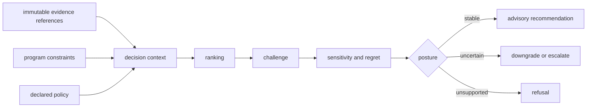
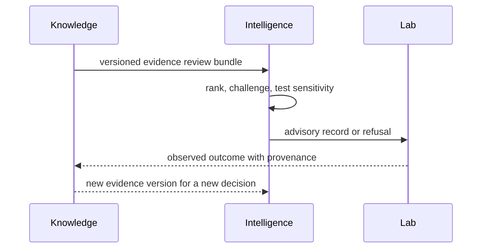

# Decision foundations

Intelligence owns the policy that transforms reviewed evidence and program
constraints into a ranked action, downgrade, escalation, or refusal. Its output
is an inspectable judgment under a declared policy. It is never a replacement
for the scientific result, evidence record, execution history, or laboratory
decision on which it depends.

## Decision routes

| Question | Guide | Governing record |
| --- | --- | --- |
| What does Intelligence own? | [Package overview](package-overview.md) | decision context and policy output |
| Is a proposal policy or upstream truth? | [Ownership boundary](ownership-boundary.md) | canonical owner and immutable input reference |
| Which analytical surfaces exist? | [Capability map](capability-map.md) | candidates, interpretation, challenge, judgment, posture, reviews |
| What is outside the decision boundary? | [Scope and non-goals](scope-and-non-goals.md) | scientific calculation, evidence truth, execution, and lab authority |
| Does the recommendation survive pressure? | [Workflow recommendation challenges](workflow-recommendation-challenges.md) | blinded and counterfactual challenge record |
| Is confidence calibrated? | [Workflow recommendation confidence](workflow-recommendation-confidence.md) | sensitivity, calibration, and regret record |

[This package does not own](../this-package-does-not-own.md) resolves common
category errors, including copying evidence into a policy model or presenting a
recommendation as laboratory authorization.

## Fact, policy, and action

| Layer | Owns | Intelligence treatment |
| --- | --- | --- |
| Core | scientific result and benchmark acceptance | reference as an input; never recalculate silently |
| Runtime | run identity, provider, state, and artifacts | use execution evidence; never rewrite run history |
| Knowledge | claims, sources, context, and contradictions | consume a versioned review bundle; never edit evidence truth |
| Intelligence | ranking, challenge, sensitivity, posture, and refusal | create a new decision record under a named policy |
| Lab | readiness, execution authority, observation, and QC | hand off an advisory action; receive outcomes as new evidence |

This separation allows two policies to reach different rankings from the same
evidence without pretending that the evidence itself changed.

## Decision protocol

1. Validate and fingerprint the complete candidate universe, including explicit
   exclusions.
2. Resolve immutable references to scientific, execution, and evidence inputs.
3. Apply a named policy with visible constraints, weights, thresholds, and
   tie-breaking.
4. Preserve score components and competing candidates, not only the winner.
5. Challenge the ranking with contradictions, falsifiers, blinded evidence,
   plausible scenarios, and counterfactuals.
6. Measure sensitivity, calibration, and regret.
7. Emit a recommendation, downgrade, escalation, or refusal with reason codes
   and human-review posture.

The feedback loop creates a new recommendation. Historical decisions remain
attached to the evidence and policy available when they were made.

## Challenge and confidence

The [recommendation challenge](workflow-recommendation-challenges.md) route asks
what evidence pattern would reverse or weaken the ranking. The
[recommendation confidence](workflow-recommendation-confidence.md) route asks
whether expressed confidence matches observed and benchmark behavior. Together
they expose:

- dependence on one fragile feature, threshold, or source;
- hidden alternatives that become preferable under plausible constraints;
- overconfidence, underconfidence, and poorly calibrated refusal;
- regret when a different action would have produced a better consequence;
- workflow-family ceilings inherited from upstream evidence.

Strong explanation without these checks is still only persuasive prose.

## Evolution rules

The [domain language](domain-language.md) stabilizes terms such as candidate,
policy, scenario, falsifier, posture, confidence, and regret. The
[change principles](change-principles.md) require policy identity and comparison
when ranking behavior changes. [Dependencies and adjacencies](dependencies-and-adjacencies.md)
and [repository fit](repository-fit.md) preserve one-way ownership, while the
[lifecycle overview](lifecycle-overview.md) connects candidate intake through
decision and downstream outcome without granting Intelligence execution or lab
authority.
