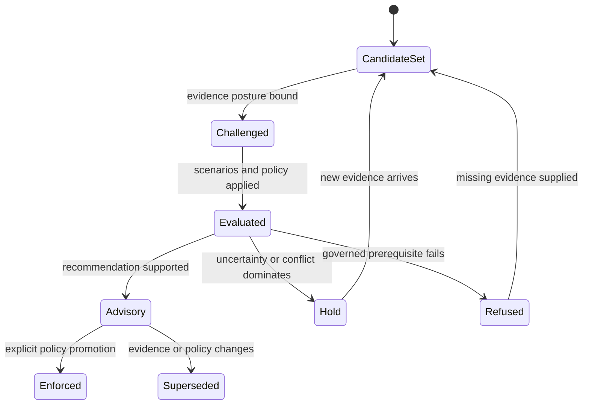

# Lifecycle Overview

An intelligence result advances only when the candidate cohort, evidence snapshot, challenge record, scenario set, and decision policy are explicit. The default endpoint is advisory decision support; enforcement requires a separate, attributable promotion.

## Evaluation lifecycle

Candidate validation and fingerprinting establish the comparison set. Evidence posture then records support, provenance, gaps, and readiness. Contradiction and falsifier passes challenge the favorable account before scenarios are evaluated.

Scenario consensus is not forced. Conflicting actions, high hold pressure, or a wide confidence spread trigger human escalation. Unresolved questions remain attached to the result. Evidence gates can downgrade a recommendation or force a hold, and the downgrade chain records why.

## Authority lifecycle

`IntelligenceDecisionSupportEnvelope` is advisory by default. Promotion to enforced policy requires a policy identifier, named promoter, and rationale. That transition grants operational authority outside the reasoning calculation; it does not make the underlying evidence stronger.

When evidence, candidates, thresholds, weights, or scenario policy changes, the previous result remains a historical decision record. A new evaluation supersedes it rather than rewriting its basis. Learning can propose a policy adaptation after outcomes are reviewed, but existing recommendations retain the exact policy under which they were produced.

## Decision dossier by state

| State | Required contents | Permitted exit |
| --- | --- | --- |
| candidate set | included and excluded candidates, eligibility policy, rejection reasons, and cohort fingerprint | bind one evidence revision |
| challenged | evidence posture, contradictions, falsifiers, missing support, calibration context, and review requirements | evaluate or refuse |
| evaluated | component scores, orientation, weights, thresholds, ties, sensitivity, alternatives, scenarios, and regret | advisory, hold, or refusal |
| advisory | preferred posture, rationale, uncertainty, downgrade path, unresolved questions, and human-review state | remain advisory, supersede, or promote explicitly |
| enforced | policy identity, promoter, rationale, time, target authority, and source advisory record | execute through the responsible downstream owner |
| superseded | replacement decision and changed evidence, candidate, or policy identities | remain immutable for audit |

A dossier is incomplete when it retains only the preferred candidate. Rejected
alternatives and refusal pressure are part of the explanation because they
show whether the outcome came from evidence, policy, or an artificially narrow
choice set.

## Supersession and feedback

Observed outcomes return as new evidence, not as edits to the old decision.
Before learning can affect later policy, the outcome record must identify the
original recommendation, actual action, operational deviations, observation,
eligibility for learning, and reviewer disposition.

| Changed input | Required response |
| --- | --- |
| evidence record, freshness, or contradiction | issue a new evidence-bound evaluation |
| candidate inclusion or hard filter | issue a new cohort fingerprint and decision |
| score orientation, weight, threshold, or tie rule | issue a new policy identity and comparison |
| calibration corpus or confidence meaning | re-evaluate confidence language and affected decisions |
| observed consequence | append a reconciliation record; preserve the original rationale |
| promotion authority | append a new authority event; do not relabel the advisory calculation |
