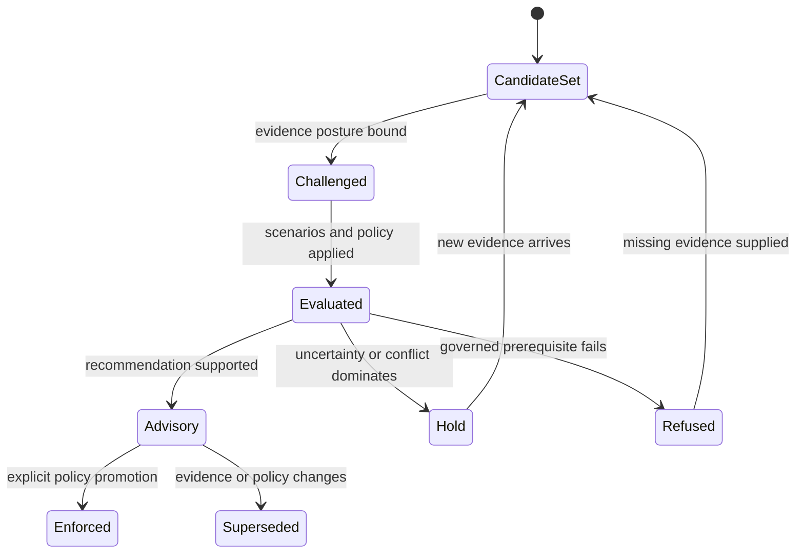

# Lifecycle Overview

An intelligence result advances only when the candidate cohort, evidence snapshot, challenge record, scenario set, and decision policy are explicit. The default endpoint is advisory decision support; enforcement requires a separate, attributable promotion.

## Evaluation lifecycle

Candidate validation and fingerprinting establish the comparison set. Evidence posture then records support, provenance, gaps, and readiness. Contradiction and falsifier passes challenge the favorable account before scenarios are evaluated.

Scenario consensus is not forced. Conflicting actions, high hold pressure, or a wide confidence spread trigger human escalation. Unresolved questions remain attached to the result. Evidence gates can downgrade a recommendation or force a hold, and the downgrade chain records why.

## Authority lifecycle

`IntelligenceDecisionSupportEnvelope` is advisory by default. Promotion to enforced policy requires a policy identifier, named promoter, and rationale. That transition grants operational authority outside the reasoning calculation; it does not make the underlying evidence stronger.

When evidence, candidates, thresholds, weights, or scenario policy changes, the previous result remains a historical decision record. A new evaluation supersedes it rather than rewriting its basis. Learning can propose a policy adaptation after outcomes are reviewed, but existing recommendations retain the exact policy under which they were produced.
