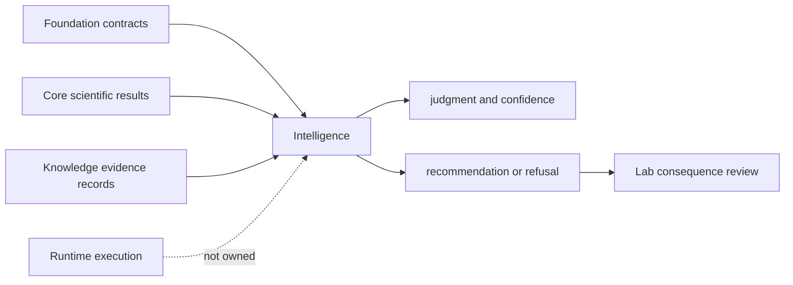

# Ownership Boundary

Intelligence owns reviewable judgment over explicit inputs. It can rank
candidates, apply declared policy, test counterfactuals, issue bounded
recommendations, and refuse a decision. It cannot turn missing evidence into
truth or convert a recommendation into an executable or laboratory action.

## Owned Decisions

| Decision surface | Representative implementation | Required evidence |
| --- | --- | --- |
| candidate eligibility and ranking | `candidates/filters.py`, `ranking.py`, `selection.py` | explicit features, ranking policy, deterministic tie behavior |
| evidence posture | `posture/evidence.py`, `posture/skeptical.py` | named evidence references and uncertainty |
| benchmark judgment | `judgment/benchmark_*.py` | corpus, policy, blinded or counterfactual challenge, retained result |
| recommendation and refusal | `judgment/recommendations.py`, `refusal.py` | rationale, confidence, blocker, allowed next action |
| review packet construction | `reviews/decision_briefs.py`, `external_review_kits.py` | traceable inputs, policy version, challenge evidence |
| bounded learning | `learning/adaptation.py` | observed outcome record and governed adaptation rule |

## Refused Ownership

| Concern | Canonical owner | Intelligence may consume |
| --- | --- | --- |
| shared identifiers and provenance primitives | Foundation | typed contracts |
| parsing, normalization, quantification, statistics | Core | validated scientific results |
| claim custody, citations, lineage, contradictions | Knowledge | evidence records and graph queries |
| execution state, retries, replay, artifacts | Runtime | completed run contracts |
| intervention feasibility, follow-up, outcomes | Lab | consequence and outcome records |

An Intelligence object must not silently redefine an upstream record merely
because recommendation code needs a convenient shape. The active duplicate
`BeliefAuditEntry`, `BeliefAuditReport`, and `BeliefAuditSummary` ownership
finding demonstrates this exact risk and remains release-blocking.

## Boundary Review

Accept a change here when the input meanings remain externally owned, the
policy is explicit, the result carries rationale and uncertainty, and a refusal
is possible. Relocate the change when it parses source evidence, controls a run,
mutates evidence custody, or records laboratory truth.

The public contract is the decision transformation—not the authority of its
inputs and not the downstream action taken from its result.
