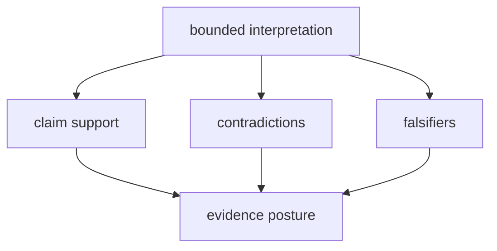

# Decision intelligence map

The intelligence package is a collection of explicit decision stages. It
keeps ranking mechanics, scientific interpretation, skeptical challenge,
policy judgment, and learning separate so a change in one can be reviewed
without silently changing the others.

## Candidate construction

`candidates` defines candidate records and schemas, validation, transformations,
filters, quality signals, fingerprints, lifecycle state, persistent stores,
ranking, and final selection. A ranking is meaningful only relative to the
candidate set it considered; excluded and invalid candidates remain part of the
audit trail.

## Interpretation

`interpretation` provides bounded readings of runs, quantitative results,
contrasts, pathways, PTMs, contaminants, and structures. These modules translate
scientific outputs into features and statements suitable for decisions. They
do not replace core calculations or knowledge grounding.

## Skeptical pressure

`claims` evaluates support, `contradictions` finds incompatible assertions, and
`falsifiers` formulates evidence that could overturn a position. `posture`
records whether the assembled evidence is strong, weak, conflicting, or
otherwise unsuitable for a decisive recommendation.



## Judgment

`judgment` contains the policy-bearing surface: scenarios, recommendation
rules, benchmark policies, confidence, decision packets, blinded challenges,
counterfactuals, sensitivity, quality, and regret. The output is a
recommendation record with enough context to explain why another policy or
scenario could produce a different answer.

`reviews` exposes that reasoning for scrutiny through workflow-specific
benchmark reviews, boards, candidate reviews, independent-rerun checks,
decision briefs, external review kits, outsider packets, release candidates,
and public-scrutiny reports.

## Learning without rewriting history

`learning` adapts future policy from review and outcome signals. Refinement
tracks convergence and stagnation explicitly. Historical evidence,
recommendations, and outcomes remain immutable inputs to the later learning
record; learning must not retroactively make an earlier decision appear better
calibrated than it was.

## Public surface

The root package exposes module families rather than a broad collection of
functions:

```python
from bijux_proteomics_intelligence import (
    candidates,
    interpretation,
    judgment,
    posture,
    refusal,
    reviews,
)
```

This is a library package without a standalone CLI or HTTP service. Runtime can
expose intelligence-backed routes while retaining ownership of transport and
execution behavior.

## Non-goals

Intelligence does not curate literature, resolve biological identifiers, run
mass-spectrometry workflows, or schedule assays. It consumes those owned
artifacts and returns a policy decision. When evidence, reproducibility, or lab
feasibility is insufficient, the correct result is a downgrade or refusal.
