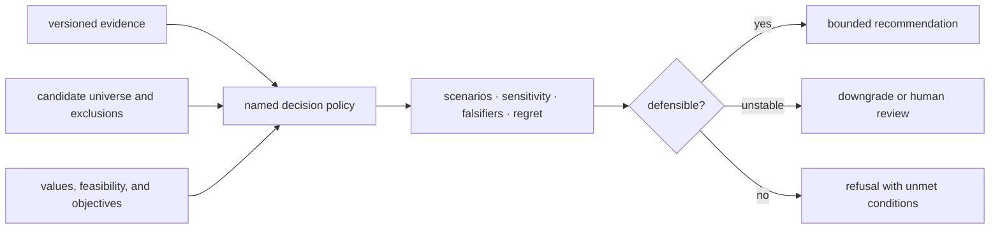

# Repository fit

Intelligence owns the accountable transformation from reviewed evidence and
constraints into an advisory decision. Its output is not “the answer”; it is a
versioned record of which candidates were considered, which policy ranked
them, how the ordering responded to challenge, and why the result was
recommended, downgraded, escalated, or refused.

## Why a separate package exists

Evidence and judgment must be independently reviewable. If ranking lives in
Knowledge, the evidence owner can silently determine action. If ranking lives
in Runtime, execution convenience can become policy. If it lives in Lab,
capacity and operational burden can be mistaken for scientific support.

## Owned surfaces

| Surface | Intelligence responsibility |
| --- | --- |
| `candidates` | candidate identity, validation, exclusions, quality, lifecycle, ranking, and selection |
| `interpretation` | policy-facing readings of governed scientific results |
| `claims` and skeptical review | expose support requirements, contradictions, and falsifiers to judgment |
| `judgment` | policy, scenarios, counterfactuals, sensitivity, confidence, regret, recommendation, and refusal |
| `posture` and `reviews` | declare evidence posture and assemble challengeable decision packets |
| `learning` | create new calibration or policy records from outcomes without rewriting history |

## Placement test

The package owns a rule when changing the decision values or constraints may
change the result while the underlying scientific and evidence records remain
unchanged.

| Change | Attribution |
| --- | --- |
| scientific metric or result changed | Core |
| source, contradiction, or evidence context changed | Knowledge |
| weights, hard constraints, objective, scenario, or tolerance changed | Intelligence |
| execution provider or artifact changed | Runtime |
| feasibility, cost, capacity, or observed outcome changed | Lab, then a new Intelligence review |

## What does not fit

- hidden scores without a candidate universe, policy identity, or explanation;
- models that rewrite evidence strength as part of ranking;
- execution or laboratory automation disguised as a “next step”;
- confidence detached from sensitivity, alternatives, and evidence posture;
- output that cannot refuse when hard constraints or support are inadequate;
- outcome-aware learning that edits the historical decision instead of creating
  a linked successor.

## Fit tests

A decision feature belongs here only when a reviewer can reproduce its inputs,
policy, ordering, challenge results, and disposition without granting the
package authority over evidence or action. The human-review state remains
explicit, and Lab performs its own readiness assessment before any executable
handoff.

Continue with [recommendation record anatomy](../index.md#recommendation-record-anatomy),
[compare decisions](../index.md#compare-decisions-without-erasing-history), and
[known limitations](../quality/known-limitations.md).
