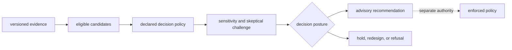

# Scope and Non-Goals

`bijux-proteomics-intelligence` owns inspectable decision support over a fixed
candidate set and evidence revision. It explains why an option progressed,
held, lost, or was refused under a named policy. It does not manufacture
evidence or authorize execution.

## In Scope

- candidate eligibility, hard filters, ranking, ties, and exclusions;
- evidence-readiness posture and decision-specific insufficiency;
- weights, thresholds, score orientation, missingness, and policy identity;
- confidence, calibration context, sensitivity, counterfactuals, and regret;
- contradiction, falsifier, skeptical-review, and human-escalation records;
- progression, hold, redesign, synthesis, and scale-up judgments;
- advisory envelopes, explicit promotion to enforced policy, and refusal;
- planned-versus-observed review and attributable policy-learning proposals.

## Explicit Non-Goals

| Not owned here | Responsible boundary |
| --- | --- |
| parsing, quantification, FDR, scientific acceptance, and benchmark truth | Core |
| process execution, provider selection, state, replay, and artifacts | Runtime |
| source custody, identity resolution, claims, and contradiction evidence | Knowledge |
| assay design, readiness, resource commitment, handoff, and observations | Lab |
| identity, serialization, provenance primitives, and schema migration | Foundation |
| release approval and repository policy | maintainer and release governance |

Intelligence also does not own autonomous progression. A high score, apparent
consensus, or calibrated confidence value remains advisory until a separate
authority promotes the decision under a named policy.

## Ownership test

A behavior belongs here when changing it can change which defensible action is
preferred while the scientific result and evidence records remain fixed. A
behavior belongs elsewhere when it changes the observations, execution
history, source meaning, or physical feasibility on which that judgment
depends.

Every public decision must retain the candidate universe, exclusions, evidence
revision, policy, challenge coverage, uncertainty, alternatives, refusal
boundary, authority state, and unresolved questions. Without that packet, the
output is a ranking result—not reviewable decision support.
