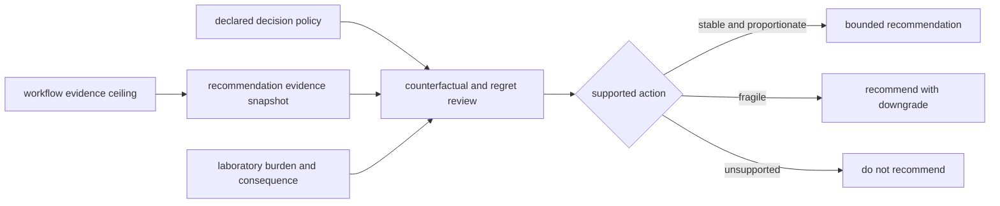

# Workflow Recommendation Confidence

This route answers the question after grounding: how strong may the current
recommendation sound once withheld evidence, comparator loss, and regret review
are taken seriously.

`bijux-proteomics-intelligence` owns this because recommendation confidence is
not a summary score. It is the pressure surface that stops attractive workflow
stories from sounding more certain than the shipped challenge artifacts earn.

## What Ships

The current confidence bundle is built around four public artifact families:

- `artifacts/intelligence/benchmark-decisions/counterfactual_recommendations.json`
- `artifacts/intelligence/benchmark-decisions/workflow_overconfidence_audit.json`
- `artifacts/intelligence/benchmark-decisions/workflow_underconfidence_audit.json`
- `artifacts/intelligence/benchmark-decisions/recommendation_regret_ledger.json`

Together they show how fragile the current public recommendation sentence still
is under evidence loss and hindsight review.

## What The Current Bundle Says

- all five flagship public families currently collapse toward
  `do_not_recommend` when comparator evidence is removed
- all five flagship public families currently collapse toward
  `do_not_recommend` when literature support is removed
- all five flagship public families currently collapse toward
  `do_not_recommend` when lab burden is doubled from the current shipped
  posture
- targeted currently carries the strongest overconfidence score at `0.67`
- none of the current flagship families yet shows a hindsight-backed
  underconfidence event strong enough to justify broader public wording

## How To Read Recommendation Confidence

- read the counterfactual report first when the question is whether the current
  call survives one missing evidence axis
- read the overconfidence audit when the sentence sounds cleaner than the
  challenge surfaces justify
- read the regret ledger when the question is which kind of mistake maintainers
  are still most likely to make if hidden evidence is revealed later

## Public-Language Limit

The confidence bundle supports bounded recommendation review. It does not earn
decision-grade authority.

Why:

- the public sentence still breaks too easily under evidence removal
- some families still carry visible overconfidence pressure
- downstream assay burden still narrows otherwise attractive recommendation
  stories
- LFQ, PTM, and targeted still stop at bounded recommendation posture

The public language must therefore remain bounded even when the underlying
workflow family has substantial analytical evidence.

## Family Evidence And Action Posture

| family | workflow evidence ceiling | current action posture | why the action remains bounded |
| --- | --- | --- | --- |
| `dda` | `review_grade_bounded` | `recommend_with_downgrade` | comparator removal and added lab burden collapse the recommendation |
| `dia` | `outsider_auditable_bounded` | `recommend_with_downgrade` | library, comparator, and consequence loss narrow the call |
| `lfq` | `outsider_auditable_bounded` | `recommend_with_downgrade` | missingness, cohort transfer, and follow-up burden block an unqualified action |
| `ptm` | `outsider_auditable_bounded` | `recommend_with_downgrade` | localization strength does not establish occupancy, function, or affordable consequence closure |
| `targeted` | `outsider_auditable_bounded` | `recommend_with_downgrade` | the highest current overconfidence pressure, calibration transfer, and interference risk constrain certainty |

Workflow evidence and recommendation confidence answer different questions. A
family can be outsider-auditable while the action remains downgraded, because
the decision also depends on policy, counterfactual stability, regret, and
laboratory burden.

## Best Next Routes

- Open [Workflow Claim Grounding](https://bijux.io/bijux-proteomics/06-bijux-proteomics-knowledge/foundation/workflow-claim-grounding/)
  when the question is whether the sentence is supported at all.
- Open [Lab Consequence](https://bijux.io/bijux-proteomics/07-bijux-proteomics-lab/foundation/lab-consequence/)
  when the question is whether downstream burden still narrows the apparently
  reasonable recommendation.
- Open [Workflow Consequence Maps](https://bijux.io/bijux-proteomics/01-bijux-proteomics/foundation/workflow-consequence-maps/)
  when the question is which downstream boundary currently caps the strongest
  honest public sentence.
- Open [What Changed The Recommendation](https://bijux.io/bijux-proteomics/01-bijux-proteomics/foundation/what-changed-the-recommendation/)
  when you need the exact evidence-removal, burden, or observed-outcome driver.
- Open [Decision Support](https://bijux.io/bijux-proteomics/01-bijux-proteomics/foundation/decision-support/)
  when the full combined route matters more than the recommendation layer by
  itself.

## Authority Boundary

Intelligence owns recommendation pressure, counterfactual stability, and
confidence limits. It consumes but cannot rewrite Knowledge grounding, Core
benchmark evidence, Runtime execution proof, or Lab consequence. A stronger
analytical record therefore cannot be translated directly into a stronger
action without independent decision and consequence evidence.
