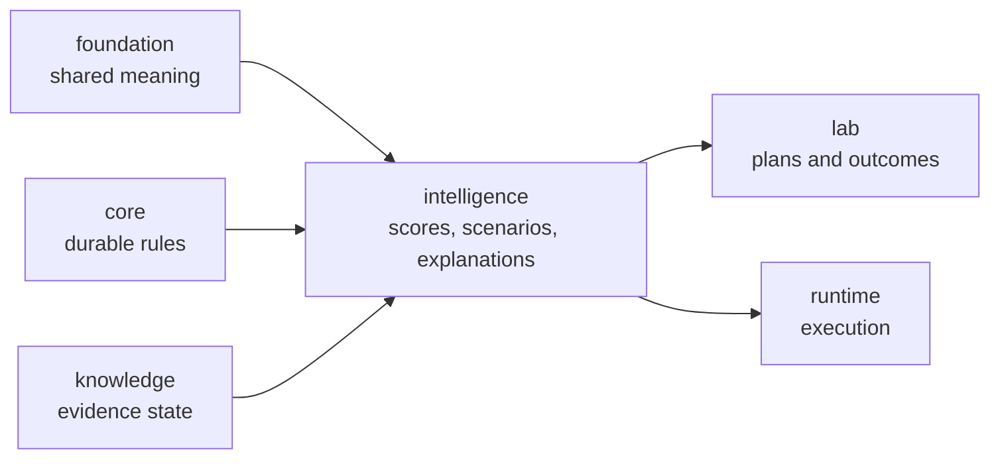

# bijux-proteomics-intelligence

`bijux-proteomics-intelligence` owns decision policy in
`bijux-proteomics`. It turns evidence and program constraints into scores,
rankings, scenarios, counterfactuals, and explanations that remain inspectable
instead of pretending to be upstream fact. This is where the system stops only
describing the world and starts making bounded judgments about what should
happen next.

This package is more concrete now than older docs suggested. It is not a vague
"decision layer." It owns recommendation posture, benchmark-backed challenge
routes, confidence and regret surfaces, interpretation summaries, and
learning-facing judgment that stays visibly separate from scientific truth.

## What Makes This Package Different

- it does not claim to be raw truth
- it turns evidence plus constraints into choices
- it must explain itself because recommendation without explanation is only
  opaque force

## What It Owns

- candidate scoring and ranking policy
- scenario evaluation and recommendation logic
- explanation and reporting surfaces for those decisions
- challenge, confidence, regret, and downgrade routes that show where the
  analytical posture narrows before the lab or operator is asked to act

## Concrete Analytical Families

| owner band | visible package substance | why it matters |
| --- | --- | --- |
| `candidates` and `claims` | ranking pressure, shortlist logic, recommendation-facing claims | analytical posture starts from explicit competitive pressure |
| `interpretation` | run summaries, differential-abundance readings, PTM and review synthesis | scientific outputs become typed analytical narratives |
| `judgment` and `posture` | review-board decisions, readiness, downgrade, regret, refusal | recommendation strength is challengeable as policy |
| `reviews` and `learning` | benchmark-backed review packets and outcome-aware refinement | the package can improve or narrow because of later evidence |

## Why This Package Matters More Now

- the repository now has enough benchmark, runtime, and grounding depth that
  recommendation posture can no longer hide behind generic prose
- stronger workflow families create stronger overconfidence risk, which this
  package must expose rather than smooth away
- the repository now ships blinded and counterfactual pressure surfaces instead
  of only confidence-sounding summaries
- lab consequence now depends on explicit analytical judgment instead of an
  implied handoff

## Shared Reader Routes

- Use [Decision Support](https://bijux.io/bijux-proteomics/01-bijux-proteomics/foundation/decision-support/)
  when the question is still about grounding, recommendation posture, or
  public artifact roles rather than one intelligence-owner module.
- Use [Workflow Consequence Maps](https://bijux.io/bijux-proteomics/01-bijux-proteomics/foundation/workflow-consequence-maps/)
  when the question is whether current recommendation language already outruns
  the weakest downstream boundary.
- Use [What Changed The Recommendation](https://bijux.io/bijux-proteomics/01-bijux-proteomics/foundation/what-changed-the-recommendation/)
  when the question is which contradiction, comparator, or lab burden actually
  moved the recommendation.
- Use [Workflow Families](https://bijux.io/bijux-proteomics/01-bijux-proteomics/foundation/workflow-families/)
  when the family trust sentence is still the main question.

## Start Inside This Package

- Open [Foundation](https://bijux.io/bijux-proteomics/05-bijux-proteomics-intelligence/foundation/)
  for the package role and boundary.
- Open [Workflow Recommendation Confidence](https://bijux.io/bijux-proteomics/05-bijux-proteomics-intelligence/foundation/workflow-recommendation-confidence/)
  when the question is where overconfidence, underconfidence, or regret already
  shows up in public artifacts.
- Open [Workflow Recommendation Challenges](https://bijux.io/bijux-proteomics/05-bijux-proteomics-intelligence/foundation/workflow-recommendation-challenges/)
  when the question is whether one family still survives hidden reveal or
  counterfactual pressure.
- Open [Architecture](https://bijux.io/bijux-proteomics/05-bijux-proteomics-intelligence/architecture/)
  when the question is how scoring, scenarios, and explanations are arranged.
- Open [Interfaces](https://bijux.io/bijux-proteomics/05-bijux-proteomics-intelligence/interfaces/)
  when the issue is a policy-facing surface or explanation output.

## Reader Questions This Package Can Answer

- why the current recommendation moved instead of staying at an earlier,
  seemingly safer posture
- which workflow families still carry bounded recommendation posture even when
  their benchmark and runtime routes look strong
- whether overconfidence, underconfidence, or regret pressure is already
  visible in the shipped analytical artifacts
- how recommendation language changes when contradiction, comparator pressure,
  or lab burden is reintroduced

## What Changed Since v0.3.7

- analytical judgment is no longer hidden inside one confidence-sounding layer
- challenge, downgrade, and regret surfaces now make overclaiming easier to
  detect from public docs
- the package now looks like a real analytical owner instead of a soft bridge
  between evidence and lab follow-up

## Analytical Proof Surfaces

- decision-support pages for repository-wide recommendation posture before the
  question narrows to one policy surface
- workflow recommendation confidence for overconfidence, underconfidence, and
  regret-facing evidence
- workflow recommendation challenges for blinded and counterfactual pressure on
  each family
- architecture and interface pages for how scoring, scenarios, and explanation
  outputs stay separated from evidence truth

## What It Refuses

- evidence truth and contradiction handling
- durable program contracts and shared payload meaning
- execution and operator-facing runtime behavior
- assay-worth claims that belong to lab consequence

## Strongest Proof Route

- start at [Decision Support](https://bijux.io/bijux-proteomics/01-bijux-proteomics/foundation/decision-support/)
  when the question is still repository-wide
- continue to [Workflow Recommendation Confidence](https://bijux.io/bijux-proteomics/05-bijux-proteomics-intelligence/foundation/workflow-recommendation-confidence/)
  when the dispute is already about recommendation pressure
- open the challenge and counterfactual routes once the question is no longer
  whether a recommendation exists, but whether it survives scrutiny

## First Proof Check

- `packages/bijux-proteomics-intelligence/src/bijux_proteomics_intelligence`
- `packages/bijux-proteomics-intelligence/tests`
- challenge, confidence, counterfactual, and regret artifacts
- explainability and reporting modules once a claim narrows to one surface
