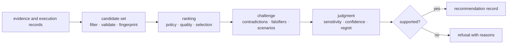

# bijux-proteomics-intelligence

`bijux-proteomics-intelligence` turns scientific evidence and program
constraints into inspectable decisions. It owns candidate ranking, scenario
analysis, skeptical challenge, recommendation posture, and refusal. It does not
own the evidence it evaluates.

```bash
python -m pip install bijux-proteomics-intelligence
```

## Decision pipeline



Every recommendation is a policy output, not a fact. The record should make
the candidate set, policy, evidence posture, sensitivity, alternatives, and
reason codes recoverable.

## Analytical capabilities

| Surface | Responsibility |
| --- | --- |
| `candidates` | typed records, validation, filtering, quality, fingerprints, ranking, selection, storage, and lifecycle |
| `interpretation` | quantitative, contrast, pathway, PTM, contaminant, structure, and run-level readings |
| `claims`, `contradictions`, `falsifiers` | support checks and skeptical pressure against an interpretation |
| `judgment` | policies, scenarios, recommendations, blinded challenges, counterfactuals, sensitivity, confidence, regret, and flagship decisions |
| `posture` | explicit evidence posture and skeptical review |
| `reviews` | benchmark reviews, review boards, decision briefs, outsider packets, independent reruns, and public scrutiny |
| `learning` | adaptation, refinement convergence, and stagnation detection |
| `next_steps`, `query`, `refusal` | action handoff, interrogation, and unsupported-claim refusal |

The package root lazily exposes these fourteen owner modules, keeping import
cost and accidental coupling low while making the supported capability families
discoverable.

## What makes a recommendation defensible

A recommendation is strongest when:

1. the candidate set and exclusions are explicit;
2. the ranking policy and input evidence are fingerprinted;
3. plausible contradictory evidence and falsifiers were evaluated;
4. ranking stability survives threshold and scenario sensitivity;
5. competing actions and the cost of error are visible;
6. confidence is calibrated against benchmark and observed outcome evidence;
7. a refusal remains possible when the support is inadequate.

Benchmark review modules cover DDA, DIA, PTM, quantification, and targeted
workflow families. Their existence does not grant equal authority to every
family; the recommendation record inherits the evidence ceiling of the input
benchmark and review packet.

## Ownership boundary

- Core owns scientific calculations and benchmark contracts.
- Runtime owns what executed and whether it can be replayed.
- Knowledge owns sources, claims, provenance, and contradiction state.
- Intelligence owns how reviewed inputs become a ranked or refused action.
- Lab owns whether that action is feasible and what happened after execution.

Intelligence may consume all of those signals, but it must not rewrite them.
Outcome-aware learning creates a new policy or calibration record rather than
editing the historical recommendation.

## Documentation map

- [Package overview](foundation/package-overview.md) describes analytical
  modules and artifact flow.
- [Recommendation challenges](foundation/workflow-recommendation-challenges.md)
  covers blinded, counterfactual, and family-specific pressure.
- [Recommendation confidence](foundation/workflow-recommendation-confidence.md)
  covers calibration, overconfidence, underconfidence, and regret.
- [Architecture](architecture/index.md) explains policy and dependency
  boundaries.
- [Interfaces](interfaces/index.md) documents Python, data, and artifact
  contracts.
- [Known limitations](quality/known-limitations.md) records where decision
  authority remains bounded.
