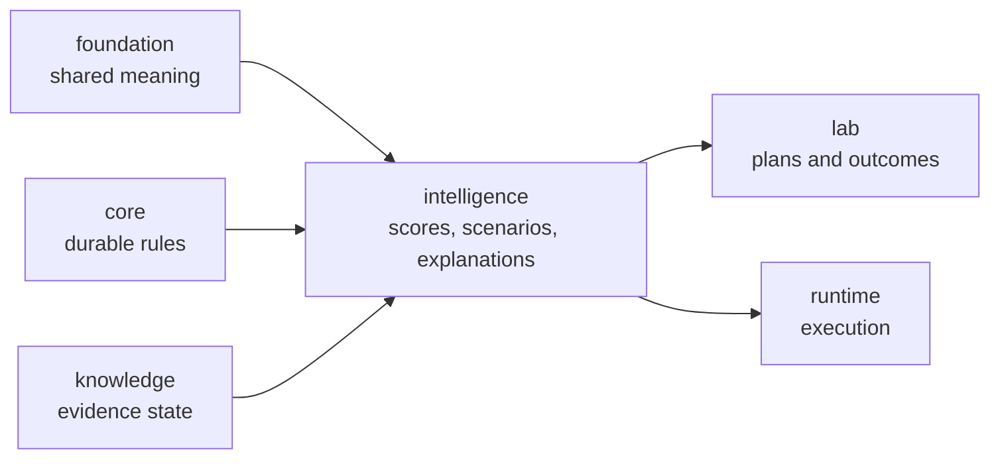

# bijux-proteomics-intelligence

`bijux-proteomics-intelligence` owns decision policy in
`bijux-proteomics`. It turns evidence and program constraints into scores,
rankings, scenarios, and explanations that remain inspectable instead of
pretending to be upstream fact. This is where the system stops only describing
the world and starts making judgments about what should happen next.

## What Makes This Package Different

- it does not claim to be raw truth
- it turns evidence plus constraints into choices
- it must explain itself because recommendation without explanation is only
  opaque force

## What It Owns

- candidate scoring and ranking policy
- scenario evaluation and recommendation logic
- explanation and reporting surfaces for those decisions

## Shared Reader Routes

- Use [Decision Support](https://bijux.io/bijux-proteomics/01-bijux-proteomics/foundation/decision-support/)
  when the question is still about grounding, recommendation posture, or public
  artifact roles rather than one intelligence-owner module.
- Use [Workflow Consequence Maps](https://bijux.io/bijux-proteomics/01-bijux-proteomics/foundation/workflow-consequence-maps/)
  when the question is whether current recommendation language already outruns
  the weakest downstream boundary.
- Use [What Changed The Recommendation](https://bijux.io/bijux-proteomics/01-bijux-proteomics/foundation/what-changed-the-recommendation/)
  when the question is which contradiction, comparator, or lab burden actually
  moved the recommendation.
- Use [Workflow Families](https://bijux.io/bijux-proteomics/01-bijux-proteomics/foundation/workflow-families/)
  when the family trust sentence is still the main question.

## Start Inside This Package

- Open [Foundation](https://bijux.io/bijux-proteomics/05-bijux-proteomics-intelligence/foundation/)
  for the package role and boundary.
- Open [Architecture](https://bijux.io/bijux-proteomics/05-bijux-proteomics-intelligence/architecture/)
  when the question is how scoring, scenarios, and explanations are arranged.
- Open [Interfaces](https://bijux.io/bijux-proteomics/05-bijux-proteomics-intelligence/interfaces/)
  when the issue is a policy-facing surface or explanation output.

## What It Refuses

- evidence truth and contradiction handling
- durable program contracts and shared payload meaning
- execution and operator-facing runtime behavior

## First Proof Check

- `packages/bijux-proteomics-intelligence/src/bijux_proteomics_intelligence`
- `packages/bijux-proteomics-intelligence/tests`
- explainability and reporting modules once a claim narrows to one surface
