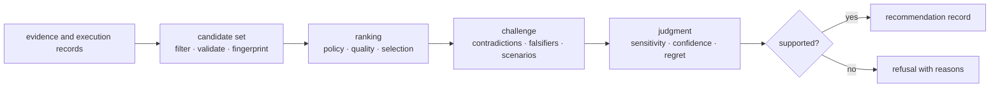
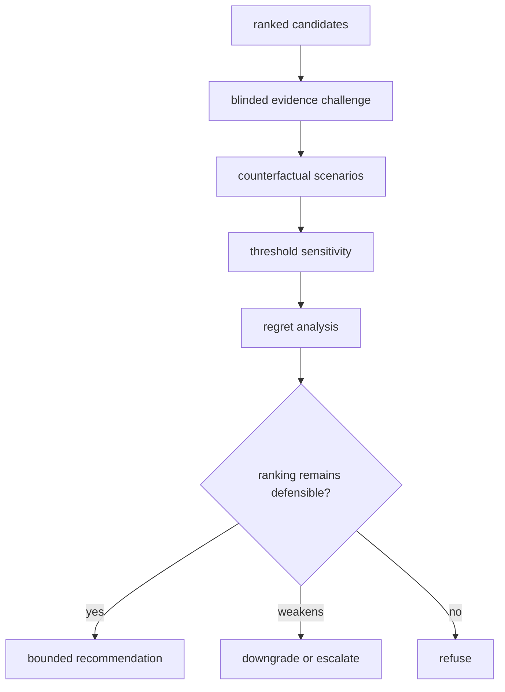
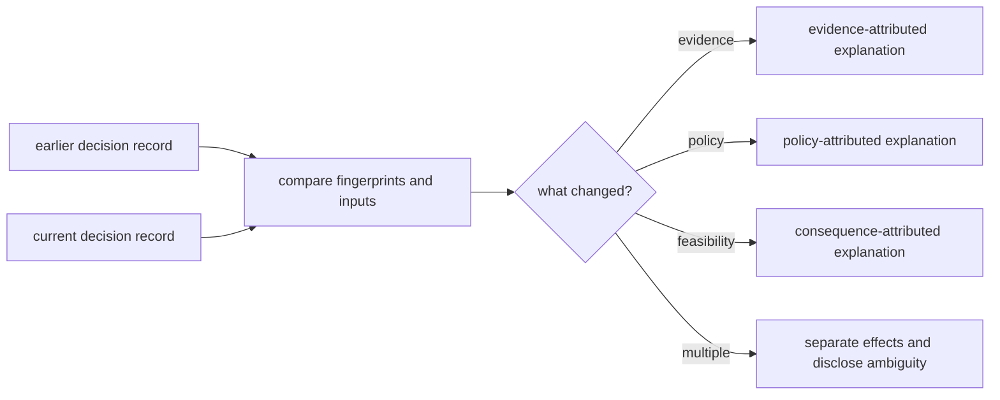
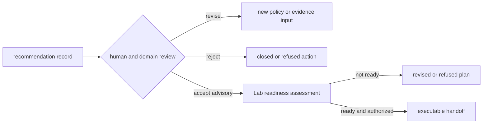
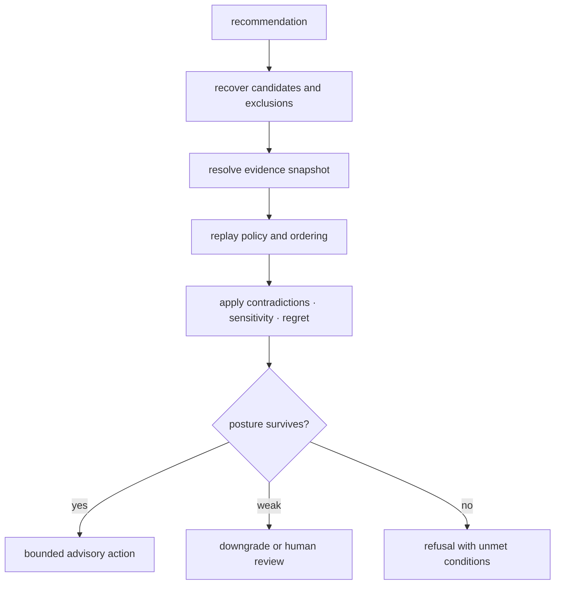

# bijux-proteomics-intelligence

`bijux-proteomics-intelligence` turns scientific evidence and program
constraints into inspectable decisions. It owns candidate ranking, scenario
analysis, skeptical challenge, recommendation posture, and refusal. It does not
own the evidence it evaluates.

```bash
python -m pip install bijux-proteomics-intelligence
```

## Decision pipeline



Every recommendation is a policy output, not a fact. Its candidate set,
policy, evidence posture, sensitivity, alternatives, and reason codes remain
recoverable so a reviewer can reproduce the judgment without treating the
result as new evidence.

## Recommendation record anatomy

| Field | Why it matters |
| --- | --- |
| candidate universe and exclusions | prevents a winning candidate from being presented without the alternatives it defeated |
| evidence references and fingerprints | ties the decision to immutable review inputs without copying or rewriting them |
| policy and constraints | exposes the values, thresholds, feasibility limits, and objectives that shaped the ranking |
| score components and ordering | makes aggregation and tie-breaking inspectable |
| contradictions and falsifiers | records evidence that weakens or could overturn the action |
| scenarios and sensitivity | shows whether small plausible changes reverse the ranking |
| confidence and regret | separates certainty language from the estimated cost of being wrong |
| posture and human-review flag | distinguishes advisory output, downgrade, escalation, and refusal |

## Analytical capabilities

| Surface | Responsibility |
| --- | --- |
| `candidates` | typed records, validation, filtering, quality, fingerprints, ranking, selection, storage, and lifecycle |
| `interpretation` | quantitative, contrast, pathway, PTM, contaminant, structure, and run-level readings |
| `claims`, `contradictions`, `falsifiers` | support checks and skeptical pressure against an interpretation |
| `judgment` | policies, scenarios, recommendations, blinded challenges, counterfactuals, sensitivity, confidence, regret, and flagship decisions |
| `posture` | explicit evidence posture and skeptical review |
| `reviews` | benchmark reviews, review boards, decision briefs, outsider packets, independent reruns, and public scrutiny |
| `learning` | adaptation, refinement convergence, and stagnation detection |
| `next_steps`, `query`, `refusal` | action handoff, interrogation, and unsupported-claim refusal |

The package root lazily exposes these fourteen owner modules, keeping import
cost and accidental coupling low while making the supported capability families
discoverable.

## What makes a recommendation defensible

A recommendation is strongest when:

1. the candidate set and exclusions are explicit;
2. the ranking policy and input evidence are fingerprinted;
3. plausible contradictory evidence and falsifiers were evaluated;
4. ranking stability survives threshold and scenario sensitivity;
5. competing actions and the cost of error are visible;
6. confidence is calibrated against benchmark and observed outcome evidence;
7. a refusal remains possible when the support is inadequate.

Benchmark review modules cover DDA, DIA, PTM, quantification, and targeted
workflow families. Their existence does not grant equal authority to every
family; the recommendation record inherits the evidence ceiling of the input
benchmark and review packet.

## Decision stability

| Observed behavior | Interpretation | Required posture |
| --- | --- | --- |
| ordering survives plausible thresholds and evidence removal | locally stable under tested pressure | bounded recommendation with tested conditions |
| top candidates exchange rank under small changes | policy-sensitive | expose alternatives and require review |
| recommendation depends on one contested source | evidence-fragile | downgrade until contradiction is resolved |
| feasible action changes when assay burden is included | consequence-sensitive | return cost and burden to the decision record |
| no candidate satisfies hard constraints | unsupported action | refuse with unmet conditions |

Stability applies only to the tested candidate universe, evidence snapshot,
policy, and scenario set. It does not imply that an omitted candidate or future
evidence could not change the result.

## Challenge before action



A recommendation that changes under a plausible threshold, withheld evidence
pattern, or feasible alternative must expose that instability. Explanation is
not a substitute for challenge; it reports how the declared policy behaved
under challenge.

## Ownership boundary

- Core owns scientific calculations and benchmark contracts.
- Runtime owns what executed and whether it can be replayed.
- Knowledge owns sources, claims, provenance, and contradiction state.
- Intelligence owns how reviewed inputs become a ranked or refused action.
- Lab owns whether that action is feasible and what happened after execution.

Intelligence may consume all of those signals, but it must not rewrite them.
Outcome-aware learning creates a new policy or calibration record rather than
editing the historical recommendation.

## Compare decisions without erasing history

When a recommendation changes, compare immutable decision records. Do not
rewrite the earlier record to match the current evidence or policy.

| Comparison dimension | Meaning of a difference | Required interpretation |
| --- | --- | --- |
| candidate universe | candidates were added, removed, or newly excluded | isolate selection effects before comparing scores |
| evidence fingerprint | the support or contradiction snapshot changed | attribute the change to evidence custody in Knowledge |
| policy fingerprint | weights, thresholds, constraints, or objectives changed | report a policy change, not scientific discovery |
| scenario set | the tested uncertainty envelope changed | compare only shared scenarios or label the new burden |
| feasibility input | cost, capacity, safety, or assay burden changed | distinguish operational consequence from evidence strength |
| ranking and posture | ordering, confidence, escalation, or refusal changed | state which upstream difference caused the disposition change |



If the responsible difference cannot be isolated, the correct output is an
attribution gap. A plausible narrative is not a substitute for matching
record identities.

## Human authority boundary

Intelligence can rank, challenge, downgrade, or refuse an action. It does not
approve clinical use, spend resources, authorize an executable laboratory
handoff, or override biosafety and operational custody. A `human_review` flag
is a required decision state, not a claim that human review has occurred.



## Shared Reader Routes

### Cross-examine a recommendation

Review a recommendation as an argument that can fail. Begin with the action,
then recover the alternatives, evidence snapshot, policy, challenge burden, and
authority boundary that produced its posture.

| Challenge | Evidence to demand | Honest response when missing |
| --- | --- | --- |
| was the winner selected from a complete declared universe? | candidate ledger and exclusion reasons | disclose selection uncertainty or refuse comparative language |
| would another reasonable policy change the ordering? | policy fingerprint, component scores, tie-breaks, and alternative policy result | label the decision policy-sensitive |
| does one contested source control the outcome? | source attribution, leave-one-source-out result, and contradiction state | downgrade until the dependency is resolved |
| does a plausible threshold reverse the action? | sensitivity surface and rank crossings | expose alternatives and require review |
| is the cost of error acceptable? | regret estimate, falsifiers, and stop conditions | narrow the action or refuse |
| is the action feasible and authorized? | Lab readiness and human decision | keep the output advisory |



Use [Workflow Consequence Maps](../01-bijux-proteomics/foundation/workflow-consequence-maps.md)
for family-specific effects,
[What Changed The Recommendation](../01-bijux-proteomics/foundation/what-changed-the-recommendation.md)
to compare decisions, and
[Lab Consequence](../07-bijux-proteomics-lab/foundation/lab-consequence.md)
for operational authority.

## Start Inside

| Need | Read next |
| --- | --- |
| understand module ownership and artifact flow | [package overview](foundation/package-overview.md) |
| pressure-test a ranking | [recommendation challenges](foundation/workflow-recommendation-challenges.md) |
| interpret confidence, calibration, or regret | [recommendation confidence](foundation/workflow-recommendation-confidence.md) |
| inspect policy and dependency boundaries | [architecture](architecture/index.md) |
| choose Python, data, or artifact contracts | [interfaces](interfaces/index.md) |
| determine when Intelligence must downgrade or refuse | [known limitations](quality/known-limitations.md) |
