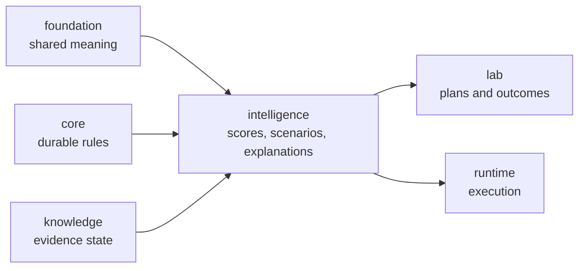

# bijux-proteomics-intelligence

`bijux-proteomics-intelligence` owns decision policy in
`bijux-proteomics`. It turns evidence and program constraints into scores,
rankings, scenarios, and explanations that remain inspectable instead of
pretending to be upstream fact. This is where the system stops only describing
the world and starts making judgments about what should happen next.

This package is also more concrete now than older docs suggested. It is not a
vague "decision layer." It owns recommendation posture, benchmark-backed
challenge routes, confidence and regret surfaces, interpretation summaries, and
learning-facing judgment that stays visibly separate from scientific truth.

## What Makes This Package Different

- it does not claim to be raw truth
- it turns evidence plus constraints into choices
- it must explain itself because recommendation without explanation is only
  opaque force

## What It Owns

- candidate scoring and ranking policy
- scenario evaluation and recommendation logic
- explanation and reporting surfaces for those decisions
- confidence, regret, and challenge-facing judgment surfaces that show where
  analytical posture narrows before the lab or operator is asked to act

## Why This Package Matters More Now

- the repository now has enough benchmark, runtime, and grounding depth that
  recommendation posture can no longer hide behind generic prose
- stronger workflow families create stronger overconfidence risk, which this
  package must expose rather than smooth away
- lab consequence now depends on explicit analytical judgment instead of an
  implied handoff
- the repository now exposes enough challenge artifacts that readers can ask
  whether a recommendation survived counterfactual pressure rather than merely
  whether it sounds persuasive

## Shared Reader Routes

- Use [Decision Support](https://bijux.io/bijux-proteomics/01-bijux-proteomics/foundation/decision-support/)
  when the question is still about grounding, recommendation posture, or public
  artifact roles rather than one intelligence-owner module.
- Use [Workflow Consequence Maps](https://bijux.io/bijux-proteomics/01-bijux-proteomics/foundation/workflow-consequence-maps/)
  when the question is whether current recommendation language already outruns
  the weakest downstream boundary.
- Use [What Changed The Recommendation](https://bijux.io/bijux-proteomics/01-bijux-proteomics/foundation/what-changed-the-recommendation/)
  when the question is which contradiction, comparator, or lab burden actually
  moved the recommendation.
- Use [Workflow Families](https://bijux.io/bijux-proteomics/01-bijux-proteomics/foundation/workflow-families/)
  when the family trust sentence is still the main question.

## Start Inside This Package

- Open [Foundation](https://bijux.io/bijux-proteomics/05-bijux-proteomics-intelligence/foundation/)
  for the package role and boundary.
- Open [Architecture](https://bijux.io/bijux-proteomics/05-bijux-proteomics-intelligence/architecture/)
  when the question is how scoring, scenarios, and explanations are arranged.
- Open [Interfaces](https://bijux.io/bijux-proteomics/05-bijux-proteomics-intelligence/interfaces/)
  when the issue is a policy-facing surface or explanation output.

## Reader Questions This Package Can Answer

- why the current recommendation moved instead of staying at an earlier,
  seemingly safer posture
- which workflow families still carry bounded recommendation posture even when
  their benchmark and runtime routes look strong
- whether overconfidence, underconfidence, or regret pressure is already
  visible in the shipped analytical artifacts
- how recommendation language changes when contradiction, comparator pressure,
  or lab burden is reintroduced

## Analytical Proof Surfaces

- decision-support pages for repository-wide recommendation posture before the
  question narrows to one policy surface
- workflow recommendation confidence for overconfidence, underconfidence, and
  regret-facing evidence
- workflow recommendation challenges for blinded and counterfactual pressure on
  each family
- architecture and interface pages for how scoring, scenarios, and explanation
  outputs stay separated from evidence truth

## What It Refuses

- evidence truth and contradiction handling
- durable program contracts and shared payload meaning
- execution and operator-facing runtime behavior

## Why Readers Misread This Package

- a weak description makes intelligence look like generic orchestration prose
  instead of accountable judgment
- recommendation posture can sound stronger than it is unless challenge and
  regret routes are shown next to the score
- this package is easiest to overstate when it is not visibly chained back to
  knowledge, runtime, and lab consequence

## Strongest Proof Route

- start at [Decision Support](https://bijux.io/bijux-proteomics/01-bijux-proteomics/foundation/decision-support/)
  when the question is still repository-wide
- continue to [Foundation](https://bijux.io/bijux-proteomics/05-bijux-proteomics-intelligence/foundation/)
  for package-owned recommendation surfaces
- open the workflow confidence and challenge handbooks once the question is no
  longer about trust language and is clearly about analytical judgment

## First Proof Check

- `packages/bijux-proteomics-intelligence/src/bijux_proteomics_intelligence`
- `packages/bijux-proteomics-intelligence/tests`
- explainability and reporting modules once a claim narrows to one surface
- challenge, confidence, and counterfactual artifacts when the question is
  whether the recommendation survived scrutiny rather than merely existed
