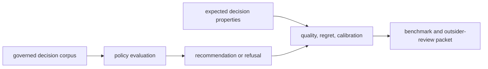

# Decision artifact contracts

An intelligence artifact must expose both the case for an action and the best
available reasons to distrust it. Decision support is credible only when a
reviewer can reconstruct evidence, policy, uncertainty, and authority.

## Review packet

A complete review packet brings together:

- candidate scores and comparative profiles;
- claim support and evidence lines;
- contradictions, falsifiers, and skeptical challenges;
- scenario outcomes and unresolved questions;
- downgrade, hold, redesign, or refusal reasons;
- concrete next-experiment proposals;
- the final recommendation and human-review requirement.

Advanced and comparative packets add multi-objective profiles, analytical-value
signals, outside-review prompts, and candidate-to-candidate contrasts. Review
board packets retain agenda entries, votes, decisions, evidence freshness, and
decision-relevant contradictions.

## Benchmark and scrutiny artifacts

The package includes decision corpora and reports for blinded challenges,
counterfactuals, confidence calibration, regret, sensitivity, policy quality,
and rejection quality. These artifacts test judgment behavior rather than only
whether code executed.

Release-candidate bundles pair trust pages with distrust pages, independent
rerun dossiers, external-review kits, and readiness scorecards. A passing
scorecard is evidence under its corpus and thresholds, not a universal claim
that the decision policy is correct.

## Stable representations

Typed `JsonModel` records are canonical. Stable JSON and JSONL support exchange
and reproducible diffs; TSV renderers provide flat review views for claim
support, contradictions, falsifiers, refusal decisions, and next experiments.
If a table cannot express nested reasons or lineage, retain a link or identifier
to the canonical record.

## Historical integrity

Never overwrite an earlier recommendation after new evidence arrives. Emit a
new record that references the previous decision, then record:

- the evidence or policy change;
- the resulting rank or action change;
- any change in confidence or review posture;
- the actor or policy that authorized enforcement;
- remaining unresolved questions.

This makes recommendation movement auditable and allows regret and calibration
analysis against what was known at decision time.

## Minimum publication set

For a consequential recommendation, publish the canonical packet, policy
lineage, evidence references, contradiction and refusal reports, unresolved
question ledger, final recommendation envelope, and a human-readable summary.
Withholding the challenge surfaces changes the meaning of the published result.
