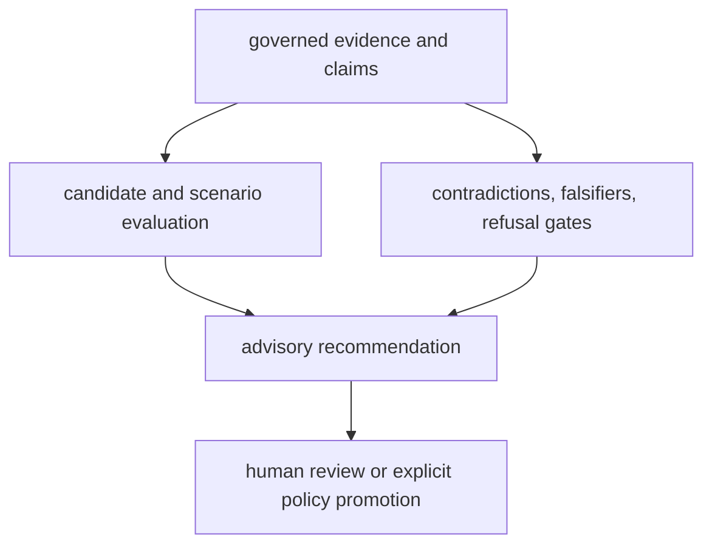

# Decision data contracts

Intelligence converts governed evidence into reviewable choices. Its contracts
keep ranking policy, uncertainty, disagreement, and human authority visible;
they do not turn analytical scores into autonomous scientific truth.

## Candidate records

A candidate carries a stable identifier, amino-acid sequence, metric mapping,
confidence vector, flags, and provenance. Optional structure records add their
provider, structure identifier, metrics, metadata, and PDB text. Governed
Pydantic variants reject unknown fields at exchange boundaries.

Selection is multi-part rather than a bare sorted list:

- `CandidateScore` records score, rank, and factor-level reasons;
- `pareto_front` identifies non-dominated candidates;
- `frozen_ids` identifies the proposed shortlist;
- `human_required` preserves the review boundary;
- policy metadata records how the selection was produced.

The standard ranking surface combines confidence, structure stability, and
novelty with explicit weights and deterministic identifier tie-breaking.
Hard-constraint filtering occurs before ranking.

## Claim-centered reasoning

Evidence claims remain the unit of challenge. Intelligence adds typed records
for:

| Contract | Question answered |
| --- | --- |
| support validation | does cited evidence satisfy the claim's declared support? |
| contradiction report | which claim pairs disagree, and with what severity? |
| falsifier report | what evidence would overturn this claim? |
| refusal report | which strong claims cross a governed evidence boundary? |
| belief audit | how should confidence change after new evidence? |

Refusal is a first-class outcome. Strong claims can be blocked for invalid
design, failed QC, weak peptide support, or inadequate PTM localization. A
refused claim retains the precise missing evidence needed to reconsider it.

## Scenario and recommendation records

Scenario evaluations preserve action, confidence, hypothesis status, unresolved
questions, and scenario-specific reasoning. Final recommendations include:

- the proposed action;
- whether human review is required;
- an optional machine-readable gate result;
- the complete downgrade chain;
- reasons supporting the recommendation.

`IntelligenceDecisionSupportEnvelope` distinguishes `advisory` output from an
`enforced` policy. Enforcement additionally requires a policy identifier,
promoting actor, and rationale. Serialization alone never promotes advice into
authority.

## Invariants

- Scores retain their policy, factors, and reasons.
- Candidate identity and provenance survive filtering and ranking.
- Scenario disagreement is summarized, not averaged away.
- Missing evidence produces a refusal, hold, downgrade, or review requirement.
- Historical evidence is not rewritten to make the current recommendation look
  inevitable.
- Advisory and enforced outputs remain distinguishable in machine-readable
  form.

These contracts make a recommendation inspectable; they do not eliminate the
need for domain review or experimental validation.
