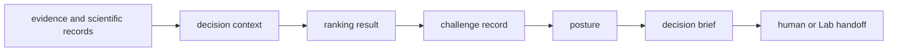
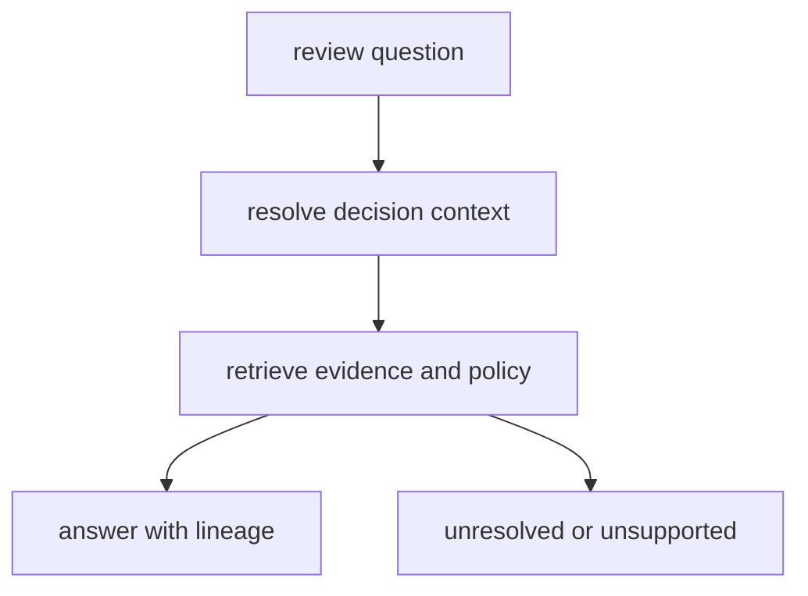

# Decision interfaces

Intelligence interfaces expose candidate evaluation, ranking, skeptical
challenge, recommendation posture, and review artifacts. Their contract is to
preserve how a decision was produced: the candidate universe, evidence
revision, policy, score components, alternatives, sensitivity, and refusal or
human-review conditions.



## Choose an owner interface

| Need | Owner module | Expected output |
| --- | --- | --- |
| validate or compare candidates | `candidates` | validated set, exclusions, quality and fingerprints |
| rank or select candidates | `candidates.ranking` and selection owners | component scores, ordering, ties, policy identity |
| interrogate claim support | `claims`, `contradictions`, `falsifiers` | support and challenge findings with evidence references |
| interpret scientific results | `interpretation` | bounded interpretation with assumptions and caveats |
| evaluate scenarios or recommendations | `judgment` | scenario, counterfactual, sensitivity, confidence, regret, recommendation |
| determine evidence posture | `posture` and `refusal` | advisory, downgrade, escalation, hold, or refusal reasons |
| assemble external review | `reviews` | report contract, decision brief, outsider packet, scrutiny record |
| propose follow-up | `next_steps` and `learning` | evidence request or policy-learning record, not execution authority |

The package root exposes 14 lazy-loaded owner modules:

```python
from bijux_proteomics_intelligence import candidates, judgment, reviews
```

Import domain symbols from their owner module. [API surface](api-surface.md)
maps supported paths and [public imports](public-imports.md) distinguishes the
candidate representations exposed for different responsibilities.

## Decision record

A portable recommendation or refusal identifies:

- decision and candidate-set identity;
- the exact Core, Runtime, and Knowledge artifact references evaluated;
- candidate exclusions and validation findings;
- policy name, version, objectives, constraints, thresholds, and tie-breaking;
- score components, ordering, alternatives, and Pareto relationships;
- contradictions, falsifiers, scenarios, and counterfactual results;
- sensitivity, calibration, confidence, and expected regret;
- advisory, downgrade, escalation, hold, refusal, and human-review posture;
- proposed next evidence without implying permission to execute it.

[Data contracts](data-contracts.md) defines these semantics and
[artifact contracts](artifact-contracts.md) defines portable review forms.

## Questions and explanations

Query and interpretation interfaces answer questions against a fixed decision
context. Explanation reports the declared reasoning path; it must not invent
missing evidence or conceal policy-sensitive alternatives.



An unsupported question produces an explicit limitation or refusal. It is not
answered by extrapolating beyond the available evidence.

## Configuration and compatibility

Weights, objectives, constraints, thresholds, missing-value handling,
tie-breaking, challenge sets, and posture rules are public decision
configuration. Their normalized identity belongs in every result. See
[configuration surface](configuration-surface.md).

Candidate fields, policy identifiers, score orientation, posture enums, reason
codes, artifact schemas, and default behavior are compatibility surfaces.
[Compatibility commitments](compatibility-commitments.md) defines comparison
and migration requirements when they change.

## Authority boundary

Intelligence can advise, challenge, request evidence, or refuse. It does not
rewrite Knowledge provenance, execute Runtime work, authorize candidate
progression, or approve laboratory activity. [Operator workflows](operator-workflows.md)
shows how those handoffs remain explicit.
